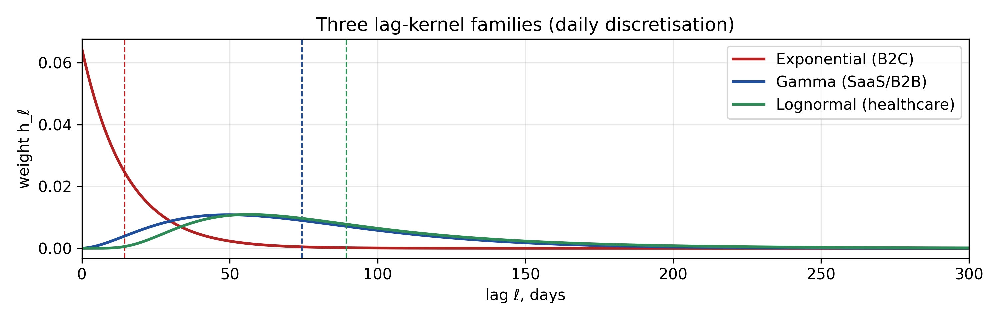
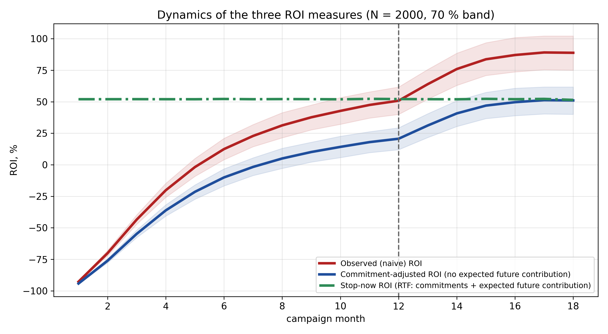
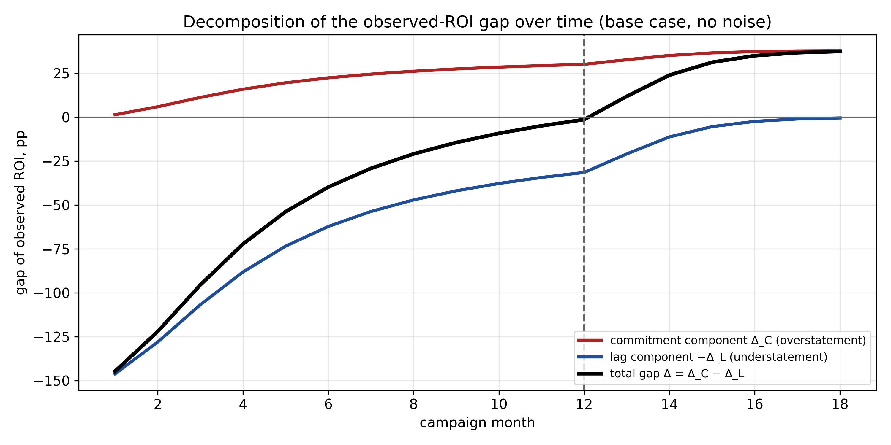
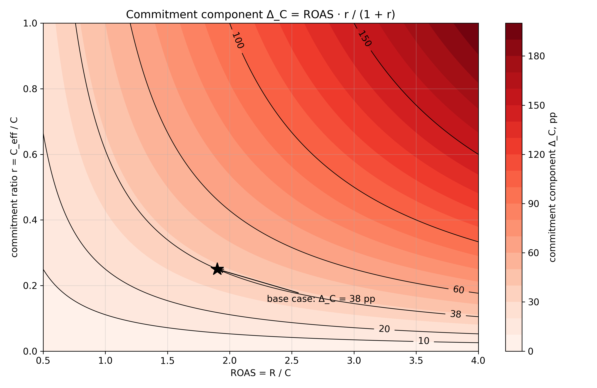
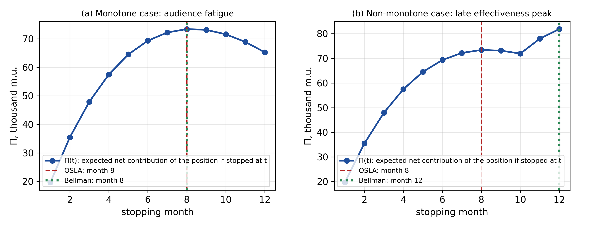
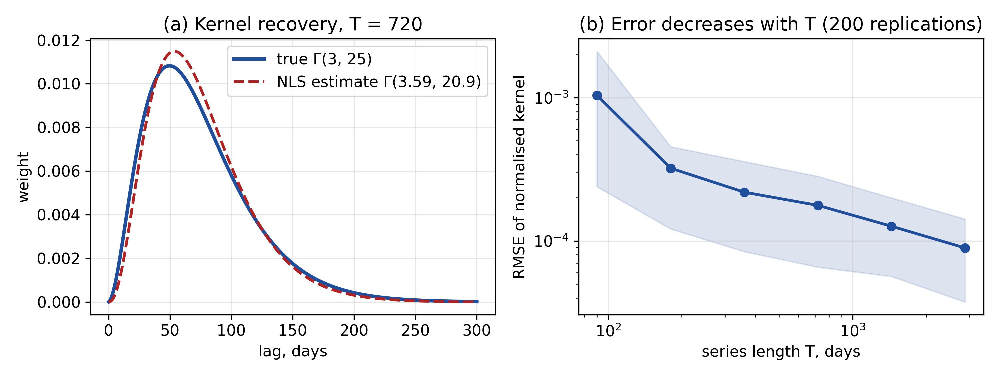

# ROI Timing Framework: Assessing Marketing Returns under Contractual Commitments and Delayed Revenue

David Gaidukovych¹

¹ Independent researcher, Los Angeles, California, USA. gaidukovych@gmail.com \| ORCID: 0000-0003-1238-3734

## Abstract

A static ROI computed from contribution already received and spend already incurred distorts decisions in long-sales-cycle industries: it ignores contractual commitments that must be honoured even if the campaign stops, and it omits contribution still to arrive from spend already made. We propose the ROI Timing Framework (RTF), a discrete-time distributed-lag response model that separates three measures: observed ROI, stop-now forecast ROI of the position, and a marginal continuation criterion. The main result is analytical: the gap between observed and stop-now ROI decomposes exactly into a commitment component $ROAS \cdot r/(1 + r)$ and a lag component $p/(1 + r)$, where $r$ is the commitment ratio and $p$ the ratio of expected but not yet received contribution to cumulative spend; observed ROI overstates if and only if $ROAS \cdot r > p$. We also derive a bound on contribution beyond the lag horizon, conditions for identification and consistent estimation of the lag kernel, and a one-step continuation rule that is optimal in the monotone case. In an illustrative SaaS case the commitment component equals 38 percentage points once the response is exhausted, whereas at the end of active spending the two components nearly offset, so the observed measure looks right by coincidence. A simulation study on synthetic data reproduces the identities numerically, tests three hypotheses and includes stress scenarios; empirical validation on real data is the next step.

**Keywords:** ROI; distributed lags; contractual commitments; sunk costs; optimal stopping; marketing mix modelling (MMM); carryover effect; SaaS marketing.

**JEL Classification:** M31, C22, C61

## 1. Introduction

**The problem.** Return on investment (ROI) remains one of the central measures of marketing effectiveness and, according to the review in \[14\], is widely used as a key criterion for allocating marketing budgets. The classical ROI formula assumes that revenue is realised at the same time as spend, that budgets can be reallocated instantly, and that the effect of a campaign ends together with its funding. In industries with long sales cycles (SaaS, B2B services, pharmaceuticals, healthcare) all three assumptions fail at once.

**First gap: conversion lag.** According to industry data \[3, 15\], the median SaaS deal cycle runs from 65 to 90 days. The lagged link from spend to revenue is described by distributed-lag models within marketing mix modelling (MMM), a class of econometric models that estimate the contribution of marketing channels to revenue while allowing for a delayed and decaying response (§2.2). Operationally, however, the lag structure is rarely built into the ROI calculation itself: the measure is computed from revenue that has actually arrived.

**Second gap: contractual rigidity of budgets.** Agency agreements, media contracts and advertising-platform licences create future obligations that are only partly refundable (cancellation incurs a penalty) and are ignored entirely by the standard ROI denominator.

**Third gap: the carryover effect.** The effect of a campaign does not end when spending stops: delayed and repeat revenue keeps arriving for several months \[10, 2\]. The carryover effect is the share of current-period revenue generated by marketing spend of earlier periods.

The first and third gaps work in the same direction: part of the revenue from spend already made has not yet arrived, and observed ROI is understated. The second gap works in the opposite direction: part of the cost has not yet been paid but is already unavoidable, and observed ROI is overstated. The direction of the total distortion is not known in advance, and this is exactly what makes the static measure an unreliable basis for a decision to continue a campaign.

### 1.1. Research question, aim and tasks

The paper answers one question: **how do contractual commitments and the unfinished revenue lag change the assessment of returns and the decision to stop a marketing campaign?**

**Aim:** to build and justify a model in which three tasks usually merged into a single ROI figure are separated explicitly: (a) observing returns already realised, (b) forecasting the return of the position held if spending stopped now, including expected residual contribution and all unavoidable costs, (c) the marginal continuation decision, which relies on incremental quantities only.

**Tasks:**

1.  Formalise three ROI measures in a discrete-time distributed-lag model with explicit contractual commitments and cancellation penalties.
2.  Derive an exact decomposition of the gap between observed ROI and stop-now ROI into a commitment component and a lag component, with bounds and a sign condition.
3.  Bound from above the contribution that arrives beyond a chosen lag horizon.
4.  State conditions for identification and consistent estimation of the lag kernel from data.
5.  Justify a one-step continuation rule and delimit its optimality.
6.  Check the derived relationships in a simulation study with hypotheses formulated before the main computation and with stress scenarios.

### 1.2. Contribution and structure

The contribution is: (i) an explicit separation of observed ROI, stop-now ROI and the marginal criterion, which removes the contradiction between counting commitments in the assessment and their irrelevance for the marginal decision; (ii) a closed-form decomposition of the observed-ROI gap into commitment and lag parts with a sign condition (Proposition 1); (iii) identification conditions for the kernel and a stopping rule stated with a clear line between what is proved and what remains a heuristic (Propositions 3 and 4); (iv) a reproducible simulation protocol with hypotheses, stress scenarios and open code. We stress that the main result is a derived identity, not an empirically measured quantity; the simulation illustrates and checks numerically, it does not confirm empirically.

**Scope of applicability.** All RTF measures rest on a correct attribution of contribution margin to marketing. The commitment and lag corrections fix the arithmetic of the measure, not its attribution: under misattribution or endogenous spend the corrected ROI remains a predictive rather than a causal estimate, and the marginal continuation criterion loses its substantive meaning. The attribution requirements are stated in §3.2 and Assumption 4; their violations are examined in the stress scenarios of §5.5.

Section 2 reviews the literature and describes the search protocol. Section 3 introduces notation, the model, the three ROI measures and the assumptions. Section 4 presents the results with proof sketches. Section 5 describes the simulation study. Sections 6 and 7 discuss and conclude. Full proofs are in Appendix A, the reproducibility protocol in Appendix B, the notation summary in Appendix C.

### 1.3. The idea in plain words

Standard ROI divides contribution by money spent. In long-cycle industries both quantities are measured incompletely: the numerator lacks the contribution still to come from spend already made, the denominator lacks the money the firm is already obliged to pay under contracts. The first error understates ROI, the second overstates it. RTF shows that both follow simple formulas: the commitment overstatement equals $ROAS \cdot r/(1 + r)$, the lag understatement equals $p/(1 + r)$, and observed ROI is overstated if and only if $ROAS \cdot r > p$. In an example with spend of 100,000, contribution of 190,000 and unavoidable commitments of 25,000, once the response is exhausted $r = 0.25$, $ROAS = 1.9$, and the commitment overstatement is 38 percentage points: an observed ROI of 90 percent against a corrected 52 percent. The same case is traced over time in §5.2.

## 2. Literature review

### 2.1. Distributed lags in marketing

The formal study of lags in economic processes goes back to Koyck \[9\], who proposed a geometrically declining weight structure. Almon \[1\] introduced polynomial restrictions that allow kernels of flexible shape to be estimated. In marketing, Clarke \[4\] meta-analysed 69 econometric studies and found that the lagged effect of advertising persists for 3 to 15 months in most product categories. The meta-analysis of Köhler, Mantrala, Albers and Kanuri \[31\] showed substantial heterogeneity of carryover across media channels (long-term share of the total effect from about 0.52 for mass advertising to about 0.69 for personal selling; median duration from 2 to 12.6 months), which justifies using different kernel families for different sectors (Table 1). Leone \[10\] showed that temporal aggregation of data leads to systematic underestimation of lag length; Tellis and Franses \[32\] established that unbiased estimation of the lag response requires matching the data interval to the unit exposure time. Both considerations are reflected in the identification conditions (§4.3) and in the simulation design (§5.5), where spend varies at a monthly rather than daily scale. Vakratsas and Ambler \[18\] reviewed 250 studies of how advertising works; Naik, Mantrala and Sawyer \[11\] showed that with dynamically changing advertising quality, optimal media planning requires explicit modelling of the lag structure.

### 2.2. Carryover effects and MMM

Marketing mix modelling (MMM) is a class of econometric models that estimate the contribution of each marketing channel to sales on aggregate time series. Its two key components are the carryover effect (adstock), which describes the decaying influence of spend over time, and the shape effect (saturation), which describes diminishing returns to spend intensity. Nerlove and Arrow \[12\] made the key contribution to carryover modelling with a dynamic model of advertising goodwill with a constant depreciation rate. Hanssens, Parsons and Schultz \[8\] systematised market response methods. Modern MMM platforms use Bayesian priors for lag kernels with carryover and shape \[19\]; hierarchical specifications with sign constraints estimate carryover, shape and scale jointly \[21\] and correct selection bias in the paid-search contribution \[20\]. In the work of this strand reviewed by the author, contractual commitments are not integrated into the final ROI calculation.

### 2.3. Measuring marketing returns and causal identification

Rust, Ambler and co-authors \[14\] showed that the dominant marketing metrics suffer from a temporal bias, that is, from ignoring long-term and delayed consequences. Srinivasan and Hanssens \[16\] linked marketing spend to firm value through dynamic models. Gallo \[7\] pointed to practical errors in ROI calculations without proposing a formal correction.

A separate causal strand has developed. Geo-experiments and incremental ROAS estimation \[22\] address the identification of the effect; notably, budget constraints there complicate causal inference directly by introducing interference between units. With observational data, instrumental variables and fixed effects are used: Gordon and Hartmann \[37\] showed, in the context of political advertising, that both instruments and fixed effects substantially change the estimated advertising effect; Sinkinson and Starc \[38\] used exogenous shifts in local media markets caused by political advertising crowding out commercial advertising; Shapiro, Hitsch and Tuchman \[39\], relying on the geographic borders of media markets, showed on a large sample of brands that advertising elasticity estimates are sensitive to the identification strategy and documented systematic over-investment in advertising at the margin. That conclusion matters here: the marginal continuation decision (§3.4) requires a causal rather than a predictive estimate of returns.

Another line treats commitment to marketing spending as a strategic choice: Currim and co-authors \[29, 30\] showed that maintaining marketing spend through recessions and under earnings pressure improves long-term firm value. This literature treats commitment as a decision to keep spending, not as a source of systematic bias in the ROI denominator.

### 2.4. Optimal stopping and investment decisions

Optimal stopping theory for irreversible investment decisions was developed by Dixit and Pindyck \[5\]; sunk costs and optionality shift the optimal stopping moment relative to the zero-threshold NPV rule. O'Brien and Folta \[28\], within real options theory, established that the interaction of sunk costs and uncertainty determines the optimal moment of market exit. One-step look-ahead rules and their optimality conditions in the monotone case are given by Chow, Robbins and Siegmund \[24\]. Forrester \[6\] and Sterman \[17\] show that lag structures in stock-and-flow system dynamics models have the same mathematical form as conversion kernels in marketing.

### 2.5. The unresolved part of the problem and the search protocol

**Targeted search protocol.** Search engine: Scite full-text search (scite.ai) over titles, abstracts and full text. Date of last search: 15 September 2026. Final queries: (1) "marketing" AND "return on investment" AND ("contractual commitments" OR "committed spend" OR "cancellation penalty") AND ("advertising" OR "campaign"); (2) ("marketing ROI" OR "advertising ROI") AND ("sunk cost" OR "irreversible") AND ("carryover" OR "distributed lag") AND ("stopping" OR "termination"). Inclusion criterion: a paper in marketing, economics or operations research in which a marketing return measure is formalised with a lagged response and explicit contractual or non-refundable costs. For query (1) the first ten results by relevance were screened; all ten were excluded as belonging to other fields (transaction cost theory, sponsorship, logistics, urban planning). Query (2) returned two results that are two versions of the same paper \[39\]; it does not meet the inclusion criterion (contractual costs are not modelled) but is used as the nearest work. In total: 12 results screened, 0 included, 1 used as nearest work. The search is not a systematic review, additional databases (Scopus, Web of Science) were not consulted, and the novelty statement below is limited to the literature reviewed by the author.

**Nearest work and how RTF differs.** The real options literature \[5, 28\] values flexibility and adjusts project value but gives no closed-form expression for the bias of the ROI measure. The commitment-to-spending papers \[29, 30\] treat commitments as a decision, not as costs in the denominator. MMM reviews \[23\] note the gap between the attribution task and the financial decision task. In the literature reviewed by the author, no work was found that simultaneously combines (a) expected residual contribution in the ROI numerator, (b) contractual commitments with a penalty function in the denominator, and (c) a marginal stopping rule.

## 3. The model

### 3.1. Time, notation and conventions

The model is in discrete time: $t = 0, 1, 2, \ldots$ indexes the reporting period (day, week or month; in the simulation of §5 the base step is one day with monthly reporting). The discrete formulation matches the structure of CRM, ERP and advertising-platform data and keeps the stopping rule (§4.4) and the simulation (§5) consistent with the model. All monetary quantities are in monetary units; cumulative quantities are denoted by capital letters, flows by lower-case letters or with a period index. The full notation summary is in Appendix C (Table C.1); every symbol is defined in the text before its first use.

### 3.2. Revenue response: the definition of $R_t$ and the status of the model

**Definition 3.1 (Response function).** Observed contribution margin in period $t$ (revenue multiplied by the margin rate $m$) is modelled as

$$y_t\; = \;\sum_{k}\sum_{\ell = 0}^{L} f_k(X_{k,t-\ell})\,\bigl(h^{\text{conv}}_{k,\ell} + h^{\text{rep}}_{k,\ell}\bigr)\; + \; Q_t^{\top}\beta\; + \;\varepsilon_t.\quad\quad(3.1)$$

Cumulative incremental contribution attributed to marketing is the realised quantity net of the control block, and it splits into the expected marketing contribution $R^{m}_t$ and an accumulated residual:

$$R_t\; = \;\sum_{s \leq t}\bigl(y_s - Q_s^{\top}\beta\bigr)\; = \;\underbrace{\sum_{s \leq t}\sum_{k}\sum_{\ell = 0}^{L} f_k(X_{k,s-\ell})\, g_{k,\ell}}_{R^{m}_t}\; + \;\sum_{s \leq t}\varepsilon_s.\quad\quad(3.2)$$

The ROI measures below use the realised quantity $R_t$ (in applications its estimate $\widehat{R}_t$ with $\hat{\beta}$ in place of $\beta$), because it is what is comparable with realised spend; the expected contribution $R^{m}_t$ is used in §4.3 and in the noise-free simulation. The decomposition of Proposition 1 is algebraic and holds for either quantity, provided it is substituted consistently into all measures.

*Name of the construction.* (3.1) is a discrete finite distributed lag regression with $L$ lags and a linear block of controls; the kernels $h$ play the role of Almon weights \[1\] or adstock weights in MMM \[19\].

*Economic meaning.* The treatment is transformed spend $f_k(X_{k,s})$; the response is contribution margin; the state is the set of responses to past spend that are still open; the error $\varepsilon_t$ is everything not explained by spend and controls. The two kernels enter additively because contribution from first conversion and contribution from repeat purchases are recorded as one flow, while their lag profiles differ (the first is concentrated around the deal cycle, the second is spread out). The kernels $h$ are not normalised: their sum $A_k$ is the long-run return of the channel in monetary units per unit of spend; the normalised kernel $w_{k,\ell}$ describes timing only and sums to one. In §5 the normalised kernel $w_k$ denotes the response shape without the scale $A_k$.

*What $R_t$ is.* $R_t$ is incremental contribution margin, not gross revenue: contribution margin ($m$ times revenue) is used because a campaign with large revenue and low margin can wrongly look profitable; the incremental part is used because organic demand, seasonality, prices, promotions and competitor actions belong to the block $Q_t^{\top}\beta$ and are subtracted from $R_t$. In applications $\beta$ is replaced by an estimate, so $\widehat{R}_t$ is an estimated rather than an observed quantity; it retains the realised residual $\sum \varepsilon_s$, that is, it is realised rather than expected contribution. Returns and cancellations enter $y_t$ with a negative sign; with negative $R_t$ the ROI measures are defined, but the bounds of Proposition 1 require $R_t \geq 0$ (see the remark after Proposition 1).

*Conditions of applicability and causal status.* The convolution of spend and contribution describes a statistical relationship and does not by itself prove a causal marketing effect: spend may rise precisely when high demand is expected. **Without an experiment, valid instrumental variables or another identification strategy, the parameters of (3.1) are interpreted as predictive associations, not as the causal effect of spend.** For the stop-now forecast ROI (3.7) the predictive interpretation suffices; the marginal decision (3.8) requires the causal one (§3.4).

*Saturation.* In the base model $f_k(x) = x$. This is a local linear approximation, valid for moderate changes in spend intensity relative to the level at which the kernel was estimated; the conclusions do not extend to multiple-fold budget changes. For large changes $f_k$ is a saturation function (for example, a Hill function as in \[19\]); the decomposition of Proposition 1 remains valid for any $f_k$, since it is algebraic in $R_t$, $R^{\text{pipe}}_t$ and $R^{\text{commit}}_t$; only the way these quantities are computed and the form of the identification conditions change.

*Units.* $X_{k,t}$ and $y_t$ are in monetary units per period, the kernels $h$ are dimensionless (monetary units per monetary unit), $R_t$, $C_t$ and all stocks are in monetary units, all ROI measures are dimensionless. *Terminology.* Below, "contribution" always means incremental contribution margin in the sense of (3.2); "revenue" is used only where the underlying figure before multiplication by $m$ is meant.

**Definition 3.2 (Expected residual contribution).** Contribution from spend made up to and including $t$ that, according to model (3.1), has not yet arrived:

$$R^{\text{pipe}}_t\; = \;\sum_{k}\sum_{s \leq t} f_k(X_{k,s})\sum_{\ell > t - s} g_{k,\ell}\; = \;\sum_{k}\sum_{s \leq t} f_k(X_{k,s})\, A_k\,\bigl\lbrack 1 - W_k(t - s)\bigr\rbrack.\quad\quad(3.3)$$

*Interpretation.* Each past spend $f_k(X_{k,s})$ will "return" $A_k$ per unit in total; by time $t$ the share $W_k(t-s)$ has been realised and the remainder $1 - W_k(t-s)$ is still in the pipeline. $R^{\text{pipe}}_t$ is a conditional expectation given known kernels and the known spend history (with respect to $\mathcal{F}_t$, generated by the history up to $t$); in applications the kernels are replaced by the estimates of §4.3, and kernel estimation error carries over into $R^{\text{pipe}}_t$ (the stress scenarios of §5.5 show how much).

**Definition 3.2a (Expected contribution from unavoidable execution).** Non-cancellable commitments come in two kinds: payments after which no service follows once the campaign stops (termination fees, compensation, unworked retainers), and payments under which placement, a licence or agency work continues regardless of the stopping decision (prepaid media inventory, an annual platform licence). Let $X^{\text{lock}}_{k,s}$, $s > t$, denote the execution schedule of the second kind in channel $k$ (zero for the first kind). The expected contribution from unavoidable future execution is

$$R^{\text{commit}}_t\; = \;\sum_{k}\sum_{s > t} f_k(X^{\text{lock}}_{k,s})\, A_k.\quad\quad(3.3a)$$

*Interpretation.* If a non-cancellable contract keeps buying advertising after the stop, its cost enters the position's costs through $C^{\text{eff}}_t$ and its response must enter the position's contribution through $R^{\text{commit}}_t$; otherwise the stop-now forecast ROI is systematically understated for contracts under which the firm keeps receiving the service. If a payment buys no service, $R^{\text{commit}}_t = 0$. In the base case of §5 the non-cancellable commitments (the remaining agency retainer) and the penalty part of the media contract are treated as payments of the first kind, so $R^{\text{commit}}_t = 0$; a second-kind scenario is examined in §5.2. The expected total contribution of the position if stopped now is $R^{\text{stop}}_t = R_t + R^{\text{pipe}}_t + R^{\text{commit}}_t$.

### 3.3. Contractual quantities

At time $t$ four quantities are distinguished: spend already paid $C_t$; the nominal remaining commitment $N_t = C^{\text{lock}}_t + C^{\text{canc}}_t$, that is, contracted amounts not yet paid; its non-refundable part $C^{\text{lock}}_t$; and the cost of immediate termination $C^{\text{eff}}_t$. The spend avoidable by stopping equals $N_t - C^{\text{eff}}_t$ plus the not yet contracted remainder of the budget. By construction $C_t$, $C^{\text{lock}}_t$ and $C^{\text{canc}}_t$ do not overlap: the first has been paid, the other two have not.

**Definition 3.3 (Cost of immediate termination and rigidity coefficient).**

$$C^{\text{eff}}_t\; = \;C^{\text{lock}}_t + \varphi\, C^{\text{canc}}_t,\quad\quad \kappa_t\; = \;\frac{C^{\text{eff}}_t}{N_t} \in \lbrack 0, 1\rbrack,\quad\quad r_t\; = \;\frac{C^{\text{eff}}_t}{C_t} \geq 0.\quad\quad(3.4)$$

*Interpretation.* $C^{\text{eff}}_t$ is the minimum future cash outflow if the campaign is stopped right after period $t$: non-refundable commitments in full plus the penalty share of cancellable ones. The rigidity coefficient $\kappa_t$ characterises the structure of the remaining commitments (at $\kappa_t = 1$ the whole remainder is non-refundable, at $\kappa_t = 0$ it is freely cancellable) and does not depend on the amount already spent $C_t$; it can change over time if, as the contract is executed, the shares of non-refundable and cancellable payments or the penalty rate change. The commitment ratio $r_t$ (the ratio of unavoidable future costs to spend already incurred) depends on the contract structure, on the moment of measurement and on cumulative spend; it can exceed one. It is $r_t$ that enters the bias formula (4.1), so the bias differs across moments of the same campaign even under unchanged contracts. In the base case of §5 commitments are taken on in proportion to spend, $C^{\text{eff}}_t = \kappa\, \min(C_t, B)$ with constant $\kappa = 0.25$, and $r_t = 0.25$ at any moment of the active campaign.

### 3.4. Three ROI measures

All measures are defined for $C_t > 0$, that is, from the first period with non-zero payments; before that the ratio is undefined. $C^{\text{eff}}_t > C_t$ (that is, $r_t > 1$) is allowed: it means more has been contracted than paid, and it violates none of the results below.

**Definition 3.4 (Observed ROI).** From contribution already received and spend already incurred:

$$ROI^{\text{obs}}_t\; = \;\frac{R_t - C_t}{C_t},\quad\quad ROAS_t\; = \;\frac{R_t}{C_t}.\quad\quad(3.5)$$

This is the standard reporting measure; below it is also called naive.

**Definition 3.5 (Commitment-adjusted ROI without residual contribution).**

$$ROI^{C}_t\; = \;\frac{R_t - S_t}{S_t},\quad\quad S_t = C_t + C^{\text{eff}}_t.\quad\quad(3.6)$$

An intermediate measure: the denominator is corrected, the numerator is not. It is needed to separate the commitment component of the bias from the lag component (Proposition 1), and because it is exactly what firms compute when they add commitments to costs but do not forecast residual contribution.

**Definition 3.6 (Stop-now forecast ROI of the position; hereafter stop-now ROI).**

$$ROI^{\text{stop}}_t\; = \;\frac{R_t + R^{\text{pipe}}_t + R^{\text{commit}}_t - S_t}{S_t}\; = \;\frac{R^{\text{stop}}_t - S_t}{S_t}.\quad\quad(3.7)$$

*Interpretation.* The numerator contains all expected contribution of the position if no new spend is made after period $t$: realised, expected from spend already made, and expected from unavoidable execution; the denominator contains all economic costs of the position, paid and unavoidable. This is a conditional forecast under the "stop now" scenario, not the ROI of the whole campaign if it is continued; it answers the question "has the position held at time $t$ paid off", so it serves for assessment and accountability for decisions already taken, and in that role it must include $C^{\text{eff}}_t$. Once the response is fully realised and there is no unavoidable execution ($R^{\text{pipe}}_t \to 0$, $R^{\text{commit}}_t = 0$) it coincides with $ROI^{C}_t$.

**Definition 3.7 (Marginal continuation criterion).** The expected net contribution of the position if stopped after period $t$, and the expected one-step gain from continuing for one more period:

$$\Pi_t\; = \;R^{\text{stop}}_t - C_t - C^{\text{eff}}_t,\quad\quad g_t\; = \;\mathbb{E}\bigl\lbrack\Pi_{t+1} - \Pi_t \mid \mathcal{F}_t\bigr\rbrack\; = \;\mathbb{E}\bigl\lbrack\Delta R^{\text{stop}}_{t+1} - \Delta C_{t+1} - \Delta C^{\text{eff}}_{t+1} \mid \mathcal{F}_t\bigr\rbrack,\quad\quad(3.8)$$

where $\Delta R^{\text{stop}}_{t+1} = R^{\text{stop}}_{t+1} - R^{\text{stop}}_t$ is the expected total contribution from period $t+1$ spend not covered by unavoidable execution (under linear response $\sum_k A_k (X_{k,t+1} - X^{\text{lock}}_{k,t+1})$, since the response of executed commitments is already counted in $R^{\text{commit}}_t$), $\Delta C_{t+1} = \sum_k X_{k,t+1}$ is new payments, and $\Delta C^{\text{eff}}_{t+1}$ is the change in the cost of termination: new commitments taken on by continuing, minus commitments executed in period $t+1$ and moved into $C_{t+1}$. The continuation decision is stated directly through the sign of $g_t$: continue if $g_t > 0$ (Proposition 4). The marginal ROI of continuation

$$ROI^{\text{marg}}_t\; = \;\frac{\mathbb{E}\lbrack\Delta R^{\text{stop}}_{t+1} \mid \mathcal{F}_t\rbrack}{\mathbb{E}\lbrack\Delta C_{t+1} + \Delta C^{\text{eff}}_{t+1} \mid \mathcal{F}_t\rbrack} - 1$$

is defined and equivalent to $g_t > 0$ only when the expected cost increment is positive, $\mathbb{E}\lbrack\Delta C_{t+1} + \Delta C^{\text{eff}}_{t+1} \mid \mathcal{F}_t\rbrack > 0$. This can fail: $\Delta C^{\text{eff}}_{t+1}$ is negative when a commitment is executed and the termination cost falls, and with small new payments the denominator can be zero or negative. In such cases the ratio is not interpreted and only $g_t$ is used.

*Why there is no sunk-cost contradiction here.* Spend already paid $C_t$ and non-refundable commitments already taken on $C^{\text{lock}}_t$ enter the level $\Pi_t$ and the level $\Pi_{t+1}$ identically and cancel in the difference $\Pi_{t+1} - \Pi_t$. Only three incremental quantities enter the marginal criterion: expected total contribution from new spend, new payments, and the change in unavoidable commitments. The model thus separates three cost concepts: already incurred (relevant for $ROI^{\text{stop}}$, irrelevant for $g_t$), unavoidable future (relevant for the level of $ROI^{\text{stop}}$, entering $g_t$ only through their change), and incremental on continuation (the only ones relevant for $g_t$). If continuing means executing a previously cancellable contract, the penalty part $\varphi\, \Delta C^{\text{canc}}$ moves from $C^{\text{eff}}$ into $C$; $g_t$ then counts only the difference between the full payment and the penalty, that is, the avoidable part.

### 3.5. Lag horizon and tail risk

**Definition 3.8 (Practical horizon and tail).** For small $\epsilon > 0$ (in §5, $\epsilon = 0.05$) the practical lag horizon and the contribution beyond it are

$$L_{\epsilon,k}\; = \;\min\bigl\{ d : 1 - W_k(d) < \epsilon\bigr\},\quad\quad L_\epsilon\; = \;\max_{k} L_{\epsilon,k},\quad\quad \delta^{\text{tail}}_t\; = \;\sum_{k}\sum_{s \leq t} f_k(X_{k,s})\sum_{\ell > L_\epsilon} g_{k,\ell}.\quad\quad(3.9)$$

The horizon is set per channel, and the common horizon is the largest of the channel horizons so that the condition "less than $\epsilon$ remaining" holds for every kernel. $\delta^{\text{tail}}_t$ measures the contribution cut off by the horizon $L_\epsilon$ when stop-now ROI is computed ex post from contribution realised by $t + L_\epsilon$ rather than from the expectation (3.3). For heavy-tailed kernels (lognormal) this quantity is material (§5.3).

### 3.6. Formal assumptions

**Assumption 1 (Spend).** Either (a) the process $\{X_{k,t}\}$ is strictly stationary and ergodic, $\mathbb{E}\lbrack X_{k,t}^4\rbrack < \infty$, and measurable with respect to the filtration $\{\mathcal{F}_t\}$; or (b) spend forms a deterministic (or predetermined) design for which the second-moment matrix of the regressors, normalised by $T$, converges to a positive definite limit. Variant (a) describes continuous marketing activity or a panel of repeated campaigns. The asymptotic results of §4.3 refer to those. Variant (b) covers a single finite campaign with a launch, even spending and a stop; stationarity does not hold there in substance. For a single finite launch the series length is bounded by the campaign duration. Consistency statements should therefore be read as referring to a sequence of campaigns or to a long operating history.

**Assumption 2 (Kernel regularity).** $h^{\text{conv}}_{k,\ell} \geq 0$, $h^{\text{rep}}_{k,\ell} \geq 0$, $\sum_{\ell} g_{k,\ell} = A_k < \infty$, $L < \infty$; the mean lag $\mu_k$ and the kernel variance are finite.

**Assumption 3 (Persistent excitation at the kernel scale).** The joint second-moment matrix of the vector of all channels and all lags $(f_k(X_{k,t-\ell}))_{k = 1..K,\ \ell = 0..L}$ (and of the controls $Q_t$) is non-singular. Non-singularity channel by channel is not enough: two channels whose spend moves almost identically do not allow their kernels to be separated. In substance, spend must vary at a time scale comparable to the kernel width (monthly budget changes rather than daily noise) and differ across channels, see \[32\] and §5.5.

**Assumption 4 (Exogeneity or instruments).** Either (a) $\mathbb{E}\lbrack\varepsilon_t \mid X_{k,t-\ell}, Q_t;\ \ell = 0, \ldots, L\rbrack = 0$ (spend is predetermined with respect to the error), or (b) there exists an instrument vector $Z_t$ such that $\mathbb{E}\lbrack Z_t \varepsilon_t\rbrack = 0$, the population moment conditions $\mathbb{E}\lbrack Z_t (y_t - \hat{y}_t(\gamma))\rbrack = 0$ have a unique zero at the true parameter vector $\gamma^{0} = (\theta^{0}, A^{0}, \beta^{0})$, and the Jacobian of these conditions with respect to all estimated parameters has full column rank at $\gamma^{0}$ (for a nonlinear model the rank of $\mathbb{E}\lbrack Z_t X_t^{\top}\rbrack$ is not sufficient). Examples of identification strategies from the literature: instrumental variables and fixed effects for market-level advertising activity, which showed the sensitivity of estimates to the identification strategy in the context of political advertising \[37\]; exogenous shifts in local media markets, namely the crowding-out of commercial inventory by political advertising in election periods \[38\]; geographic borders of media markets, when the advertising decision is made at the market level while demand is measured at a finer level \[39\]; randomised geo-holdouts \[22\]. The exclusion restriction holds if the instrument affects contribution only through the firm's spend. For instruments related to prices or availability of inventory, this requires that competitors do not respond to the same shocks in a way correlated with $\varepsilon_t$. This restriction must be checked in each application.

**Assumption 5 (Error structure).** $\{\varepsilon_t\}$ is strictly stationary, $\mathbb{E}\lbrack\varepsilon_t\rbrack = 0$, $\mathbb{E}\lbrack\varepsilon_t^{4}\rbrack < \infty$, and $\alpha$-mixing with coefficients $\alpha(j)$ such that $\sum_j \alpha(j)^{1/2} < \infty$; heteroskedasticity and autocorrelation are allowed. The covariance matrix of the estimates is then estimated by a HAC estimator \[13\] or a block bootstrap \[27\]; these procedures concern inference (standard errors and intervals), not the consistency of point estimates.

**Assumption 6 (Deterministic commitments).** $C^{\text{lock}}_t$, $C^{\text{canc}}_t$ and $\varphi$ are known at time $t$.

**Assumption 7 (Model extension: an observed modifier of repeat contribution).** This assumption is not a condition on model (3.1) but an extension of it. There exists an observed modifier $V_t$ (for example, the share of repeat customers in the base or an indicator of a retention programme) that scales the carryover component and does not scale the conversion component:

$$y_t\; = \;\sum_k \sum_\ell f_k(X_{k,t-\ell})\,\bigl(h^{\text{conv}}_{k,\ell} + V_t\, h^{\text{rep}}_{k,\ell}\bigr) + Q_t^{\top}\beta + \varepsilon_t,\quad\quad(3.1a)$$

where $V_t$ is uncorrelated with $\varepsilon_t$ and the joint second-moment matrix of the extended regressor vector $(f_k(X_{k,t-\ell}),\ V_t f_k(X_{k,t-\ell}))_{k,\ell}$ is non-singular. Non-zero variance of $V_t$ alone is not enough: $V_t$ must vary independently of the lag structure of spend. The extension is needed only for separate identification of $h^{\text{conv}}$ and $h^{\text{rep}}$ (Proposition 3(b)); the aggregate kernel $g_k$ in model (3.1) is identified without it.

**Assumption 8 (Parametric identification).** The kernel belongs to a known parametric family $g_{k,\ell} = A_k\, w_{\ell}(\theta_k)$, and the full parameter vector $\gamma = (\theta_1, \ldots, \theta_K, A_1, \ldots, A_K, \beta)$ belongs to the set $\Gamma = \Theta^{K} \times \mathcal{A}^{K} \times \mathcal{B}$, where (a) model (3.1) is correctly specified at some $\gamma^{0}$ in the interior of $\Gamma$; (b) $\Theta$, $\mathcal{A} \subset (0, \infty)$ and $\mathcal{B}$ are compact; (c) the map $\theta \mapsto (w_\ell(\theta))_{\ell = 0}^{L}$ is continuous and injective; (d) the population criterion $Q(\gamma) = \mathbb{E}\lbrack (y_t - \hat{y}_t(\gamma))^{2}\rbrack$ has a unique global minimum at $\gamma^{0}$. Full rank of the information matrix at $\gamma^{0}$, which follows from Assumptions 3 and 8(c), gives only local identification. It is necessary but not sufficient for (d), so uniqueness of the global minimum is postulated separately; its status is discussed after Proposition 3; (e) if regularisation $\lambda_T \|\theta\|^{2}$ is used, the coefficient satisfies $\lambda_T \to 0$ as $T \to \infty$.

### 3.7. Estimation from data: quantities, sources and methods

**Table 1. Theoretical quantity, data source and estimation method.**

| Quantity | Data source | Estimation method |
|----------------------------------------------|--------------------------------------------------------------------------|-----------------------------------------------------------|
| $X_{k,t}$ | advertising platforms (daily spend), agency invoices, ERP | direct observation; aggregation to the model step |
| $y_t$, $m$ | CRM (deals, closing dates, amounts), ERP (cost of sales), billing | period revenue times margin rate; returns with a negative sign |
| $Q_t$ | promotion calendar, price lists, seasonality indices, competitor monitoring | included in (3.1) as controls |
| $h_{k,\ell}$, $A_k$, $\theta_k$ | series of $X_{k,t}$ and $y_t$ at least several kernel widths long | nonlinear least squares (under Assumption 4a) or nonlinear 2SLS/GMM with $Z_t$ (under 4b); family from Table 2 |
| $h^{\text{conv}}$, $h^{\text{rep}}$ separately | CRM: new versus repeat customer flag as $V_t$ | the same method under Assumption 7 |
| $R_t$ | output of estimating (3.1) | $\sum_{s \leq t}(y_s - Q_s^{\top}\hat{\beta})$ |
| $R^{\text{pipe}}_t$ | estimated kernels and spend history | formula (3.3) with $\hat{g}$ |
| $C_t$ | accounting (payments) | direct observation |
| $C^{\text{lock}}_t$, $C^{\text{canc}}_t$ | contracts: payment schedules, termination terms | commitment register; monthly update of the remainder |
| $\varphi$ | termination terms in contracts | direct observation; an interval under uncertainty |
| $L_\epsilon$ | estimated kernel | formula (3.9) |

### 3.8. Parametric kernel families

**Table 2. Parametric lag-kernel families (daily step).**

| Family | Typical sector | Base-case parameters | $\mu$ (days) | CV | $L_{0.05}$ (days) |
|-------------------|--------------------|-------------------------------------------------------|-------------|------|--------------------|
| Exponential | B2C, e-commerce | $\lambda = 1/15$ | 14.5 | 1.03 | 44 |
| Gamma | SaaS, B2B | $\alpha = 3$, $\beta = 25$ | 74.5 | 0.58 | 157 |
| Lognormal | Healthcare | $\sigma = 0.55$, $\mu_{\ln} = \ln 90 - \sigma^{2}/2$ | 89.5 | 0.60 | 191 |

*Ranges and starting points for estimation.* Exponential: $\lambda \in \lbrack 1/400, 1\rbrack$, start $\lambda = 1/30$. Gamma: $\alpha \in \lbrack 0.2, 30\rbrack$, $\beta \in \lbrack 1, 400\rbrack$, start $(\alpha, \beta) = (1.5, 60)$. Lognormal: $\sigma \in \lbrack 0.1, 2\rbrack$, $\mu_{\ln} \in \lbrack 0, 7\rbrack$, start $(\sigma, \mu_{\ln}) = (1, \ln 60)$. The scale $A$ starts from the ratio of mean contribution to mean spend. The weights are obtained by discretising the densities at the midpoints of daily intervals and normalising over $L = 730$ days; $\mu$ and CV are given for the discretised kernels. The starting point is deliberately displaced from the true values so that estimation does not start from the answer.

{width="6in"}

Figure 1. Weights of the three lag-kernel families on the daily grid. Vertical dashed lines mark the mean lag $\mu$. Parameters: Table 2.

## 4. Theoretical results

The status of each statement is made explicit: Proposition 1 and Corollary 1 are algebraic identities, Proposition 2 is an inequality, Proposition 3 is a set of sufficient conditions with reference to standard asymptotic theory, and Proposition 4 is an optimality result under an additional condition and a heuristic without it.

### 4.1. Decomposition of the gap between observed ROI and stop-now ROI

**Proposition 1 (Exact decomposition).** Let $C_t > 0$, $C^{\text{eff}}_t \geq 0$, $R_t \geq 0$, $R^{\text{pipe}}_t \geq 0$, $R^{\text{commit}}_t \geq 0$, and write $R^{\text{fut}}_t = R^{\text{pipe}}_t + R^{\text{commit}}_t$, $p_t = R^{\text{fut}}_t / C_t$. Then

$$\Delta^{C}_t\; \equiv \;ROI^{\text{obs}}_t - ROI^{C}_t\; = \;\frac{R_t\, C^{\text{eff}}_t}{C_t\, S_t}\; = \;ROAS_t \cdot \frac{r_t}{1 + r_t},\quad\quad(4.1)$$

$$\Delta^{L}_t\; \equiv \;ROI^{\text{stop}}_t - ROI^{C}_t\; = \;\frac{R^{\text{fut}}_t}{S_t}\; = \;\frac{p_t}{1 + r_t},\quad\quad(4.2)$$

$$\Delta_t\; \equiv \;ROI^{\text{obs}}_t - ROI^{\text{stop}}_t\; = \;\Delta^{C}_t - \Delta^{L}_t\; = \;\frac{ROAS_t \cdot r_t - p_t}{1 + r_t},\quad\quad -\,p_t\; \leq \;\Delta_t\; \leq \;ROAS_t \cdot r_t.\quad\quad(4.3)$$

The sign of the gap is determined by comparing two ratios:

$$\Delta_t \geq 0\quad \Longleftrightarrow\quad ROAS_t \cdot r_t\; \geq \;p_t.\quad\quad(4.4)$$

*Economic interpretation.* Observed ROI deviates from stop-now ROI by two parts of opposite sign. The commitment part $\Delta^{C}_t$ is always non-negative: commitments enlarge the cost base and the observed measure does not see them. The lag part $\Delta^{L}_t$ is also non-negative and is subtracted: expected contribution from spend already made and from unavoidable execution has not yet arrived. Observed ROI overstates when the return multiplied by the commitment ratio exceeds the ratio of not yet received contribution to spend, and understates otherwise. $ROAS_t$ and $r_t$ come from reporting and the commitment register; $p_t$ is computed from the estimated model, so condition (4.4) is checked from reporting and the estimated model, not observed directly. Relations (4.1)–(4.4) are identities: the simulation of §5 does not confirm them, it shows their numerical values at given parameters.

*Proof sketch.* Write $S = C + C^{\text{eff}}$. Then $ROI^{\text{obs}} - ROI^{C} = (R - C)/C - (R - S)/S = R(S - C)/(CS) = R\,C^{\text{eff}}/(CS)$, and dividing numerator and denominator by $C^{2}$ gives (4.1). Next, $ROI^{\text{stop}} - ROI^{C} = R^{\text{fut}}/S$, which gives (4.2) after division by $C$. Subtracting (4.2) from (4.1) gives (4.3); the bounds follow from $S \geq C$. Full proof: Appendix A.1.

*Remark on degenerate cases.* When $R_t < 0$ (returns exceed revenue) identities (4.1)–(4.3) still hold, but $\Delta^{C}_t$ changes sign together with $R_t$, and observed ROI understates rather than overstates the commitment-adjusted measure; the bounds (4.3) then fail. When $C_t = 0$ the measures are undefined. When $r_t > 1$ all relations continue to hold.

**Corollary 1 (Monotonicity and the limiting case).** Holding the other quantities fixed,

$$\frac{\partial \Delta^{C}_t}{\partial C^{\text{eff}}_t} = \frac{R_t}{S_t^{2}} > 0,\quad\quad \frac{\partial \Delta^{L}_t}{\partial R^{\text{fut}}_t} = \frac{1}{S_t} > 0,\quad\quad \frac{\partial \Delta_t}{\partial C^{\text{eff}}_t} = \frac{R_t + R^{\text{fut}}_t}{S_t^{2}} > 0,\quad\quad(4.5)$$

and once the response is fully realised and commitments are executed ($R^{\text{fut}}_t \to 0$) the gap converges to the commitment component: $\Delta_t \to \Delta^{C}_t \geq 0$. In other words, the lag component vanishes over time, the commitment component does not. The penalty $\varphi$ affects $\Delta^{C}_t$ only through $C^{\text{eff}}_t$.

### 4.2. Upper bound on contribution beyond the lag horizon

**Proposition 2 (Tail bound).** If $\sum_{\ell > L_\epsilon} g_{k,\ell} \leq \eta_k$ for every channel $k$ and $f_k \geq 0$, then

$$0\; \leq \;\delta^{\text{tail}}_t\; \leq \;\sum_{k}\eta_k \sum_{s \leq t} f_k(X_{k,s})\; \leq \;\sum_{k}\eta_k\, (t + 1)\, \max_{s \leq t} f_k(X_{k,s}).\quad\quad(4.6)$$

*Economic interpretation.* Contribution realised beyond the practical horizon cannot be computed without the full kernel, but it can be bounded from above by the product of the kernel's tail mass and cumulative transformed spend. This is a truncation-error bound, not an identification result: $\eta_k$ is an assumption about the kernel, not a quantity estimated from data. For a normalised kernel $\eta_k = A_k \epsilon$ by construction of $L_\epsilon$. Proof: Appendix A.2.

### 4.3. Conditions for identification and consistent estimation of the lag kernel

**Proposition 3 (Identification and consistency conditions).** (a) Under Assumptions 1–3, 4(a), 5 and 8 the parameters $(\theta_k^{0}, A_k^{0})$ of the aggregate kernel $g_k$ are identified, and the nonlinear least squares estimator

$$(\hat{\theta}_T, \hat{A}_T)\; = \;\arg\min_{\theta \in \Theta,\ A}\ \frac{1}{T}\sum_{t = 1}^{T}\left( y_t - Q_t^{\top}\beta - \sum_k A_k \sum_{\ell = 0}^{L} f_k(X_{k,t-\ell})\, w_\ell(\theta_k) \right)^{2} + \lambda_T \|\theta\|^{2}$$

is consistent: $(\hat{\theta}_T, \hat{A}_T) \to (\theta_k^{0}, A_k^{0})$ in probability, and, by continuity of the map in Assumption 8(c), $\hat{g}_k \to g_k$ in $\ell^{2}$. Under Assumption 4(b) instead of 4(a) the same conclusion holds for the nonlinear GMM estimator with instruments $Z_t$, given the uniqueness of the zero of the population moments and the full-rank Jacobian of the moment conditions included in 4(b). (b) Separate identification of $h^{\text{conv}}_k$ and $h^{\text{rep}}_k$ additionally requires Assumption 7: without an observed modifier that scales one kernel and not the other, the kernels enter (3.1) only through their sum and are not separately identified.

*Proof sketch.* Statement (a) is a special case of the consistency theorem for extremum estimators \[40, Theorem 2.1\]: (i) compactness of $\Gamma$ (Assumption 8b); (ii) continuity of the criterion in the parameters (Assumption 8c); (iii) uniqueness of the global minimum of the population criterion (Assumption 8d; Assumption 3 together with injectivity 8(c) gives only local identification); (iv) a uniform law of large numbers, provided by stationarity, ergodicity and the mixing conditions (Assumptions 1, 5) together with finite fourth moments. Penalisation with $\lambda_T \to 0$ does not change the limit of the criterion. Nonlinear least squares asymptotics in the stationary setting go back to \[26\]. Statement (b): with $V_t \equiv \text{const}$ the function $y_t$ depends on $(h^{\text{conv}}, h^{\text{rep}})$ only through their sum, and any pair with the same sum generates the same distribution of the data; under Assumption 7 the sum and the coefficient on $V_t$ identify both kernels. Full argument: Appendix A.3.

*Remark on the status of Proposition 3.* The statement separates three distinct questions. First, identification of the theoretical model, that is, uniqueness of the parameters at which the model reproduces the conditional mean; it follows from Assumptions 3 and 8(c) and is proved in Appendix A.3. Second, uniqueness of the global minimum of the population criterion, that is, absence of spurious local minima with a comparable value; it does not follow from the first question and is postulated by Assumption 8(d), which shifts part of the identification burden into the assumptions and is listed as a limitation in §6.3. Third, convergence of a particular numerical algorithm from a chosen starting point to the global minimum; this is a property of the algorithm, not of the model, it is not part of Proposition 3, and it is examined by the estimation diagnostics in §5.5 (several starting points, convergence rate, boundary hits).

*Remark on HAC.* The HAC estimator \[13\] and the block bootstrap \[27\] give consistent estimates of the covariance matrix under autocorrelated errors and are needed for confidence intervals; they do not affect the consistency of point estimates. Put differently, when Assumption 4 fails, no correction of standard errors removes the bias (the "endogeneity" stress scenario in §5.5).

### 4.4. Campaign continuation rule

Decisions are taken on a discrete grid of periods $t = 0, 1, \ldots, T_{\max}$, $T_{\max} < \infty$. Let $\Pi_t$ be defined by (3.8), $\mathbb{E}\lbrack|\Pi_t|\rbrack < \infty$ for all $t$, and let $\tau$ denote a stopping time with respect to $\{\mathcal{F}_t\}$ taking values on the grid. The value function of the stopping problem

$$V_t\; = \;\sup_{\tau \geq t}\ \mathbb{E}\lbrack\Pi_\tau \mid \mathcal{F}_t\rbrack$$

satisfies the Bellman equation \[25\] $V_t = \max\{\Pi_t,\ \mathbb{E}\lbrack V_{t+1} \mid \mathcal{F}_t\rbrack\}$ with terminal condition $V_{T_{\max}} = \Pi_{T_{\max}}$.

**Proposition 4 (One-step continuation rule).** Define the one-step look-ahead (OSLA) rule: stop at the first period

$$\tau^{\text{OSLA}}\; = \;\min\{ t : g_t \leq 0\},\quad\quad g_t = \mathbb{E}\lbrack\Pi_{t+1} - \Pi_t \mid \mathcal{F}_t\rbrack,\quad\quad(4.7)$$

that is, continue while the expected total contribution (including the not yet received part) from next period's spend exceeds new payments together with the change in unavoidable commitments. (a) If the monotonicity condition (M) holds, namely the set $\{ t : g_t \leq 0\}$ is absorbing, so that $g_t \leq 0$ implies $g_s \leq 0$ almost surely for all $s > t$, then $\tau^{\text{OSLA}}$ is optimal: $\mathbb{E}\lbrack\Pi_{\tau^{\text{OSLA}}}\rbrack = V_0$. (b) Without (M) rule (4.7) is a heuristic: it never stops later than the optimum, but it may stop earlier and forgo contribution from a later rise in $g_t$; a guaranteed optimum requires solving the Bellman equation by backward induction.

*Economic interpretation.* (M) holds when the expected return on the next unit of spend does not increase over time (audience fatigue, kernel decay past its mode, saturation) and incremental commitments are non-negative. Then the rule "continue while $g_t > 0$" (under a positive cost increment: while the marginal ROI of continuation is positive) is exact. Under linear response and commitments proportional to spend, $g_t = \Delta C_{t+1}\,(A - 1 - \kappa)$, and the rule reduces to comparing the long-run return with one plus the marginal commitment coefficient:

$$\text{continue}\quad \Longleftrightarrow\quad A\; > \;1 + \kappa.\quad\quad(4.8)$$

(M) fails under a late effectiveness peak (seasonal demand, a delayed product launch): OSLA then stops the campaign before the peak (§5.4). The model is risk-free and undiscounted; Assumption 6 makes commitments deterministic. Full optionality in the spirit of \[5\] requires uncertainty and discounting and is left for future work. Proof: Appendix A.4.

## 5. Simulation study

### 5.1. Structure of the simulation study and design

The simulation study has three parts of different status. Part A checks the implementation of the analytical identities: relations (4.1)–(4.4) are exact, and the simulation only confirms that the code reproduces them numerically and that Monte Carlo means are not distorted by noise. Part B tests three genuinely simulation hypotheses, formulated before the main computation (no external registration was made). Part C contains stress tests of estimation and diagnostics of the algorithm.

**Table 3. Structure of the simulation study.**

| Part | Content | Section |
|------------------------------|----------------------------------------------------------------------------------------------------|----------|
| A. Identity checks | Monte Carlo means reproduce (4.1)–(4.4); decomposition of the gap over time; comparison of four ROI measures | §5.2 |
| B. Hypothesis H1 | At the end of active spending the lag component $\Delta^{L}$ is larger for kernels with a heavier right tail | §5.3 |
| B. Hypothesis H2 | The error of recovering the normalised kernel decreases with series length $T$; coverage of 95 percent intervals is close to nominal | §5.5 |
| B. Hypothesis H3 | The OSLA rule coincides with the Bellman solution when condition (M) holds and departs from it when (M) fails | §5.4 |
| C. Stress tests and diagnostics | Eight violations of assumptions; kernel separability; several starting points, parameter bounds, error distribution | §5.5 |

*Outcome for Part B.* The results are consistent with all three hypotheses; for H2 this holds when spend varies at the kernel scale (§5.5).

**Base case.** A SaaS firm with a budget $B = 100{,}000$ monetary units spent evenly over 12 months (365 days) through a single channel; a gamma kernel with the parameters of Table 2; long-run return $A = 1.9$, so that expected total contribution margin is $190{,}000$; margin rate $m = 1$ and a zero organic block for readability (this does not restrict the generality of the identities). Commitments are taken on in proportion to spend: non-refundable $C^{\text{lock}}$ up to $20{,}000$ (an agency retainer with payments beyond the spending horizon), cancellable $C^{\text{canc}}$ up to $10{,}000$ (a media contract) with penalty $\varphi = 0.5$; in total $C^{\text{eff}}_t = 0.25\, \min(C_t, B)$, $\kappa = 0.25$. Reporting is monthly (30-day step), the observation horizon is 18 months. Randomness enters as multiplicative noise on the month's cumulative contribution, $\varepsilon \sim \mathcal{N}(0, 0.07^{2})$. The number of replications differs across experiments: $N = 2{,}000$ in the base experiment, 200 in the kernel estimation experiments and stress scenarios, 100 in the kernel separability experiment. We stress that the data are synthetic and the base-case parameters ($A = 1.9$, $\kappa = 0.25$, $\varphi = 0.5$, the commitment amounts) are an illustrative calibration, not empirical estimates; sources \[3, 15\] support only the order of magnitude of the deal cycle. The study shows the behaviour of the derived formulas; it is not an empirical test of them.

**Temporal aggregation.** Spend, kernels and contribution are defined on a daily grid; reporting is by 30-day months, so the $m$-th reporting month closes on day $30m$ and the 18-month horizon equals 540 days. The cumulative quantities $R_t$, $R^{\text{pipe}}_t$, $C_t$ and $C^{\text{eff}}_t$ are computed daily and taken on the last day of the month; monthly contribution is the sum of daily contributions. Active spending covers days 1 to 365, so by the close of month 12 (day 360) 98.6 percent of the budget has been paid and the remaining five days of spend fall into month 13; this is visible in Table 5 and in the figures as a small continued rise of $C_t$ after the vertical line. In the base experiment (Figure 2) noise is multiplicative and added once per month to cumulative contribution at month end, $R^{\text{obs}}_{m} = R_{30m}(1 + \varepsilon_m)$; it models reporting error rather than daily volatility. In the kernel estimation experiments (§5.5) noise is instead daily and additive, since a daily series is estimated there. There are no partial months in the design.

**Table 4. Base scenario parameters.**

| Parameter | Value | Source or rationale |
|----------------------------------------------------|------------------------|---------------------------|
| Total budget $B$ | 100,000 m.u. | typical SaaS campaign |
| Active spending horizon $T$ | 12 months (365 days) | annual planning cycle |
| Spend profile | uniform by day | base case |
| Kernel family | gamma, $\alpha = 3$, $\beta = 25$ | median SaaS cycle \[3, 15\] |
| Mean lag $\mu$ | 74.5 days | from the kernel |
| Long-run return $A$ | 1.9 | calibrated to $190{,}000$ |
| Non-refundable commitments $C^{\text{lock}}$ | up to 20,000 | agency retainer |
| Cancellable commitments $C^{\text{canc}}$ | up to 10,000 | media contract |
| Cancellation penalty $\varphi$ | 0.50 | typical term |
| Marginal commitment coefficient $\kappa$ | 0.25 | $25{,}000 / 100{,}000$ |
| Contribution noise $\sigma_\varepsilon$ | 7 percent | at the monthly level |
| Tail threshold $\epsilon$ | 0.05 |   |
| Number of replications $N$ | 2,000 |   |

### 5.2. Part A: dynamics of the three measures and decomposition of the gap

Figure 2 shows the three ROI measures by month. Observed ROI rises from minus 93 percent in month 1 to 89.5 percent by month 18, when residual contribution is exhausted; commitment-adjusted ROI without residual contribution rises from minus 95 to 51.6 percent; stop-now ROI under linear response, proportional commitments and $R^{\text{commit}} = 0$ is constant at $A/(1 + \kappa) - 1 = 52.0$ percent at any moment of the active campaign. The constancy of $ROI^{\text{stop}}$ is not an artefact: under linear response every unit of spend "costs" $1 + \kappa$ and "returns" $A$, so the return of the position if stopped does not depend on how much has already been spent. Monte Carlo means by month 18 are 88.8, 51.1 and 51.4 percent (70 percent bands from 75.0 to 102.1 and from 40.0 to 61.7 percent for the first two measures); the deviation from the deterministic values reflects the nonlinearity of the ratio under multiplicative noise.

{width="6in"}

Figure 2. Dynamics of observed ROI, commitment-adjusted ROI and stop-now ROI. The vertical dashed line marks the end of active spending (month 12). Bands are 70 percent quantile intervals over $N = 2{,}000$ replications.

**Unavoidable-execution scenario.** If the non-refundable 20,000 in the base case is not the remainder of an agency fee but prepaid media inventory that will be placed after the stop with the same return $A = 1.9$, then by (3.3a) $R^{\text{commit}}_{12} = 38{,}000$, the ratio of not yet received contribution to spend in month 12 rises from $p = 0.393$ to $0.778$, the lag component from 31.5 to 62.3 pp, and stop-now ROI from 52.0 to 82.8 percent. Ignoring the response to unavoidable execution would understate stop-now ROI by 30.8 pp at the same costs, which is why the two kinds of non-refundable payments must be distinguished (Definition 3.2a).

**Decomposition over time.** Figure 3 shows the components (4.1)–(4.3) without noise. The commitment component grows with ROAS from 1.1 pp in month 1 to 30.1 pp in month 12 and 37.9 pp in month 18. The lag component falls from 145 pp in month 1 to 31.5 pp in month 12 and 0.4 pp in month 18. The total gap changes sign: observed ROI is heavily understated at the start of the campaign, almost coincides with stop-now ROI at the end of spending (minus 1.3 pp), and is overstated by 37.5 pp once the response is realised. The closeness of observed ROI to stop-now ROI in month 12 is a coincidence of two errors of opposite sign, not a property of the measure: by condition (4.4), at that moment $ROAS \cdot r = 1.507 \times 0.25 = 0.377$ against $p = 0.393$.

{width="6in"}

Figure 3. Decomposition of the gap between observed ROI and stop-now ROI into commitment and lag components (base case, no noise).

**Table 5. Four ROI measures by month (base case, no noise, percent). Benchmark: stop-now ROI after the response is exhausted, 52.0.**

| Measure | Month 3 | Month 6 | Month 9 | Month 12 | Month 15 | Month 18 |
|------------------------------------------|------------|------------|------------|------------|------------|------------|
| Observed (no lags, no commitments) | −43.5 | 12.2 | 37.6 | 50.7 | 83.3 | 89.5 |
| Commitments only ($ROI^{C}$) | −54.8 | −10.2 | 10.1 | 20.5 | 46.7 | 51.6 |
| Lags only (residual contribution, no commitments) | 90.0 | 90.0 | 90.0 | 90.0 | 90.0 | 90.0 |
| RTF stop-now ROI ($ROI^{\text{stop}}$) | 52.0 | 52.0 | 52.0 | 52.0 | 52.0 | 52.0 |

Table 5 shows the contribution of each component: the lag correction alone gives a stable but 38 pp overstated measure; the commitment correction alone gives the right limit, but only after the response is exhausted; both corrections together give a stable and correct measure from the first month. In applications with an estimated kernel the stability of $ROI^{\text{stop}}$ will be disturbed by the estimation error in $R^{\text{pipe}}_t$ (§5.5).

**Map of the commitment component.** Figure 4 presents $\Delta^{C} = ROAS \cdot r/(1 + r)$ as a function of two observable parameters; the base case ($ROAS = 1.9$, $r = 0.25$) is marked with a star. Table 6 gives the total gap (4.3) on a grid of $r$ and $p$: the column $p = 0$ corresponds to a fully realised response.

{width="6in"}

Figure 4. Contour map of the commitment component $\Delta^{C} = ROAS \cdot r/(1 + r)$. The star marks the base case.

**Table 6. Total gap $\Delta = (ROAS \cdot r - p)/(1 + r)$ at $ROAS = 1.9$, percentage points (identity (4.3); illustrative).**

| Commitment ratio $r$ | $p = 0$ | $p = 0.10$ | $p = 0.25$ | $p = 0.50$ |
|--------------------------|--------------|--------------|--------------|--------------|
| 0.10 | 17.3 | 8.2 | −5.5 | −28.2 |
| 0.25 | 38.0 | 30.0 | 18.0 | −2.0 |
| 0.50 | 63.3 | 56.7 | 46.7 | 30.0 |
| 0.75 | 81.4 | 75.7 | 67.1 | 52.9 |

*Notation.* $r$: commitment ratio $C^{\text{eff}}/C$; $p$: ratio of expected but not yet received contribution to cumulative spend; $\Delta$: gap between observed ROI and stop-now ROI. The penalty $\varphi$ affects the table only through $r$; at $r \geq 0.5$ with an exhausted response the overstatement exceeds 63 pp, and the static measure may be insufficient for a scaling decision.

### 5.3. Hypothesis H1: tail risk across kernel families

Table 7 gives, for the three families, the ratio $p$ and the gap components at the end of active spending, with the same spend profile and the same long-run return.

**Table 7. Gap components in month 12 by kernel family ($A = 1.9$, $\kappa = 0.25$).**

| Family | $\mu$ (days) | $L_{0.05}$ (days) | $p_{12}$ | $\Delta^{C}_{12}$ (pp) | $\Delta^{L}_{12}$ (pp) | $\Delta_{12}$ (pp) |
|----------------------|------------|----------------|------------|------------------|------------------|----------------|
| Exponential | 14.5 | 44 | 0.077 | 36.4 | 6.1 | +30.3 |
| Gamma | 74.5 | 157 | 0.393 | 30.1 | 31.5 | −1.3 |
| Lognormal | 89.5 | 191 | 0.471 | 28.6 | 37.7 | −9.1 |

*Notation.* $\mu$: mean lag; $L_{0.05}$: practical lag horizon; $p_{12}$: ratio of expected but not yet received contribution to spend in month 12; $\Delta^{C}_{12}$ and $\Delta^{L}_{12}$: commitment and lag components (4.1)–(4.2); $\Delta_{12}$: their difference (4.3).

The heavier the right tail, the more contribution remains in the pipeline at the end of spending and the more observed ROI understates stop-now ROI; for the short exponential kernel the lag component is small and the commitment overstatement already dominates in month 12. The tail mass beyond $L_{0.05}$ is close to 0.05 for all families by construction, so the bound (4.6) in month 12 is of the same order for all of them ($0.05 \times 190{,}000 = 9{,}500$), and the differences between families are determined by the kernel shape within the horizon.

### 5.4. Hypothesis H3: the one-step rule against the Bellman solution

Under linear response and proportional commitments $g_t = \Delta C_{t+1}\,(A - 1 - \kappa) = 8{,}219 \times 0.65 = 5{,}342$ monetary units per month, the sign is constant, and by (4.8) the campaign should run to the end: stopping at any moment leaves $ROI^{\text{stop}}$ unchanged but reduces absolute contribution. To make the rule substantive, diminishing returns to cumulative spend (audience fatigue) are introduced: $A(s) = A_0 \exp(-C_s/K)$ with $K = 60{,}000$ and $A_0 = 3.90$, calibrated so that the campaign-average return stays at 1.9. Then $g_t$ decreases monotonically, condition (M) holds, and both OSLA and backward induction stop the campaign after month 8 ($C = 65{,}753$); expected net contribution of the position if stopped is $73{,}401$ against $65{,}259$ if the campaign runs to the end, and stop-now ROI is 89.3 against 52.9 percent.

In the second scenario a late effectiveness peak is added to fatigue (a multiplier $1 + 2.0 \exp(-((s - 330)/20)^{2})$, for instance seasonal demand in month 11). Condition (M) fails: $g_t$ turns negative in month 8 and positive again in month 10. OSLA stops the campaign after month 8 with contribution $73{,}401$; backward induction continues to month 12 with contribution $81{,}878$. The loss from applying the heuristic is $8{,}477$ monetary units, or 10.4 percent (Figure 5). This is the price of condition (M): the one-step rule is exact when the future is no better than the present, and it errs towards premature stopping when the best is still ahead.

{width="6in"}

Figure 5. Expected net contribution of the position $\Pi_t$ if stopped after month $t$. (a) Monotone case: OSLA and backward induction coincide. (b) Non-monotone case: OSLA stops before the late effectiveness peak.

**Grid of late-peak scenarios.** Table 7a shows the loss of OSLA relative to the Bellman solution for different heights and timings of the late peak (the same fatigue profile, multiplier $1 + a \exp(-((s - c)/20)^{2})$, height $a$, centre $c$ in days).

**Table 7a. Loss of the one-step rule relative to the Bellman solution, percent of expected contribution; in parentheses the stopping month of OSLA / Bellman.**

| Peak height $a$ | $c = 270$ | $c = 300$ | $c = 330$ | $c = 360$ |
|--------------------|------------|------------|------------|------------|
| 0.5 | 0.0 (10 / 10) | 1.0 (8 / 10) | 0.0 (8 / 8) | 0.0 (8 / 8) |
| 1.0 | 0.0 (10 / 10) | 6.4 (8 / 11) | 0.2 (8 / 12) | 0.0 (8 / 8) |
| 1.5 | 0.0 (10 / 10) | 0.0 (11 / 11) | 5.6 (8 / 12) | 0.0 (8 / 8) |
| 2.0 | 0.0 (10 / 10) | 0.0 (11 / 11) | 10.4 (8 / 12) | 0.0 (8 / 8) |
| 2.5 | 0.0 (10 / 10) | 0.0 (11 / 11) | 14.7 (8 / 12) | 2.3 (8 / 12) |

*Note.* Loss equals $(\Pi_{\text{Bellman}} - \Pi_{\text{OSLA}})/\Pi_{\text{Bellman}}$; a zero loss means that condition (M) holds or that the peak does not change the optimum. An early peak ($c = 270$) arrives before $g_t$ turns negative and only postpones the OSLA stopping point; a late and high peak ($c = 330$, $a \geq 1.5$) produces losses from 5.6 to 14.7 percent, because OSLA stops the campaign two months before the peak. A peak at the very end of the horizon ($c = 360$) is partly cut off by the end of the campaign and barely changes the decision.

### 5.5. Hypothesis H2 and Part C: kernel recovery, consistency, stress scenarios and diagnostics

**Design.** Data are generated from (3.1) with one channel, a gamma kernel $\Gamma(3, 25)$ and $A = 1.9$ on a daily grid. Spend is set by monthly budget levels (lognormal, $\sigma = 0.5$) held for 30 days, with 10 percent daily noise; this variation at the kernel scale satisfies Assumption 3. In a preliminary experiment with independent daily spend noise and no monthly variation, the estimation error did not decrease with $T$: information about the kernel shape came only from the transient at the start of the series. This numerically reproduces the finding of \[32\] on matching the interval of variation to the exposure time and is kept in the text as a warning. Contribution noise is Gaussian with a standard deviation of 30 percent of the mean level. The parameters $(A, \alpha, \beta)$ are estimated by nonlinear least squares from the starting point of Table 2 within the admissible range of the same table. Metrics: integrated squared error of the normalised kernel (ISE) and its root (RMSE), error of the mean lag, error of the tail mass beyond $L_{0.05}$, bias of $A$, coverage of 95 percent Wald intervals for $\alpha$ and $\beta$, and the share of replications in which the sign of the gap (4.4) in month 12 is determined correctly with the estimated kernel.

**Recovery and convergence (H2).** At $T = 720$ days the estimate is $\hat{\alpha} = 3.59$, $\hat{\beta} = 20.9$, $\hat{A} = 1.895$; the mean lag is reproduced with an error of 0.02 days, the tail mass is underestimated by 0.011 (Figure 6a). Table 8 shows the behaviour of the metrics across $T$ (200 replications per point).

**Table 8. Quality of kernel estimation by series length (200 replications, base DGP).**

| $T$, days | RMSE | MLE, days | TME | Bias of $A$ | Coverage $\alpha$ / $\beta$ | Correct sign |
|----------|--------------|--------------------------|----------------|------------|------------------|----------------|
| 90 | 10.4 | +28.7 ± 76.7 | +0.100 | +1.466 | 0.94 / 0.89 | 0.53 |
| 180 | 3.2 | +1.4 ± 8.6 | +0.008 | +0.023 | 0.94 / 0.97 | 0.71 |
| 360 | 2.2 | −0.1 ± 2.7 | −0.001 | −0.003 | 0.94 / 0.94 | 0.81 |
| 720 | 1.8 | +0.4 ± 2.3 | +0.002 | +0.000 | 0.94 / 0.95 | 0.90 |
| 1440 | 1.3 | +0.1 ± 1.9 | +0.000 | −0.001 | 0.96 / 0.94 | 0.93 |
| 2880 | 0.9 | −0.1 ± 1.4 | −0.000 | −0.000 | 0.96 / 0.95 | 0.96 |

*Notation.* RMSE: root integrated squared error of the normalised kernel, ×10⁻⁴. MLE: mean-lag error, mean ± standard deviation across replications. TME: tail-mass error beyond the horizon $L_{0.05}$. Bias of $A$: mean bias of the long-run return estimate. Coverage: share of 95 percent Wald intervals covering the true $\alpha$ and $\beta$. Correct sign: share of replications in which the sign of the gap $\Delta_{12}$ by (4.4), computed with the estimated kernel, matches the sign under the true kernel.

The error decreases with $T$ in all metrics, interval coverage is close to nominal, and the share of correct sign decisions rises from the level of a coin toss with one quarter of data to 0.96 with eight years. This is a numerical illustration of Proposition 3 at finite $T$, not a proof of consistency: consistency is a limiting property, and the simulation only shows that the error decreases as the series length grows in one DGP.

{width="6in"}

Figure 6. (a) Kernel estimated by nonlinear least squares against the true $\Gamma(3, 25)$ at $T = 720$. (b) RMSE of the normalised kernel as a function of series length (log-log; the shaded band is the 15th to 85th percentile over 200 replications).

**Estimation diagnostics.** To separate properties of the algorithm from properties of the model (see the remark on the status of Proposition 3), at $T = 720$ and 200 replications of the base DGP estimation was started from three points: $(\alpha, \beta) = (1.5, 60)$, $(6, 10)$ and $(1, 150)$, that is, with mean lags of 90, 60 and 150 days against the true 74.5. Results: the algorithm converged from all three starts in all 200 replications; no estimate landed on a boundary of the admissible range; the maximum spread of the mean lag between solutions from different starts within one replication was below 0.001 days at the median and did not exceed 0.001 days in 95 percent of replications, so all starts find the same minimum. Narrowing the parameter range to $\alpha \in \lbrack 0.5, 10\rbrack$, $\beta \in \lbrack 5, 150\rbrack$ changed neither the mean nor the spread of the error (standard deviation of the mean-lag error 2.65 days in both cases) and again produced no boundary hits. The distribution of the mean-lag error across replications: the 5th, 25th, 50th, 75th and 95th percentiles are −4.2, −1.6, −0.0, +1.8 and +4.5 days; the distribution is symmetric without heavy tails. In this DGP, therefore, uniqueness of the global minimum (Assumption 8d) is confirmed numerically and there are no discrepancies between starts; in the stress scenarios with endogeneity and seasonality the spread is far larger (Table 9), and there a multi-start check becomes mandatory.

**Stress scenarios.** Table 9 reports the same metrics at $T = 720$ for eight violations of the assumptions; in every scenario a gamma kernel is estimated from the same start (200 replications).

**Table 9. Stress scenarios at $T = 720$ (200 replications; deviations from true values).**

| Scenario | RMSE | MLE, days | TME | Bias of $A$ | Error in $p_{12}$ |
|----------------------------------------------------|------------|------------------|--------------|------------|------------|
| Base | 1.8 | +0.1 ± 2.6 | +0.001 | +0.000 | +0.001 |
| Wrong family (lognormal truth, gamma estimated) | 3.3 | −5.7 ± 2.8 | −0.026 | −0.015 | −0.029 |
| Endogeneity (a persistent demand shock drives both spend and contribution) | 8.3 | −4.0 ± 28.1 | +0.006 | +0.058 | −0.025 |
| Structural break (return falls by 40 % in the second half) | 7.7 | −10.0 ± 5.8 | −0.032 | −0.459 | −0.053 |
| Seasonality (not included in $Q_t$, amplitude 30 %) | 9.1 | −4.5 ± 13.9 | −0.006 | −0.063 | −0.024 |
| Margin change (from 1.0 to 0.8 from mid-series, not modelled) | 4.2 | −5.7 ± 3.9 | −0.021 | −0.228 | −0.030 |
| Omitted channel (a second channel with an exponential kernel) | 6.6 | +1.8 ± 8.1 | +0.030 | +0.628 | +0.009 |
| Low spend variation (monthly $\sigma = 0.05$) | 3.6 | +0.2 ± 3.7 | +0.002 | +0.002 | +0.001 |

*Notation.* As in Table 8; the error in $p_{12}$ is the difference between the ratio of expected but not yet received contribution to spend in month 12 under the estimated and under the true kernel.

Three conclusions. First, a wrong kernel family with a close mean lag carries over into $p_{12}$ only weakly (minus 0.029): stop-now ROI is robust to a moderate error in shape. Second, violations that change the level of return over time (a break, seasonality, margin, an omitted channel) bias mainly $A$, and through it the marginal criterion (4.8). A bias of 0.46 in $A$ at a true value of 1.9 is enough to flip the sign of $A - 1 - \kappa$. Third, endogeneity at the given shock strength biases $A$ moderately (+0.058) but sharply inflates the dispersion of the lag estimate: a standard deviation of 28 days against 2.6. This confirms the remark to Proposition 3: correcting standard errors is no substitute for an identification strategy. Low spend variation at $T = 720$ degrades the estimate only moderately, because the transient at the start of the series retains part of the information; with shorter series the effect is stronger.

**Kernel separability.** Table 10 illustrates Proposition 3(b): at $T = 1{,}440$ data are generated from the sum of a conversion kernel $\Gamma(3, 25)$ with weight 1.2 and a carryover kernel $\Gamma(6, 30)$ with weight 0.7; both kernels are estimated from two starting points, and the fit with the smaller residual sum of squares is kept.

**Table 10. Separate recovery of the kernels without and with the modifier $V_t$ (100 replications, median relative ISE).**

| Condition | Conversion kernel | Carryover kernel | Sum of kernels |
|----------------------------------------------------|----------------|----------------|----------------|
| Without modifier (Assumption 7 fails) | 0.013 | 0.063 | 0.0002 |
| With modifier $V_t \sim U(0.5,\ 1.5)$ | 0.0002 | 0.0009 | 0.0001 |

*Notation.* Relative ISE: integrated squared error of the scaled kernel divided by the integrated square of the true kernel; median across replications.

Without the modifier the sum of the kernels is recovered with a relative error of 0.02 percent, whereas the components have errors 60 and 300 times larger: the fit finds one of many pairs with the same sum. The modifier reduces the component errors to the level of the error of the sum.

## 6. Discussion

### 6.1. Comparison with alternative approaches

RTF sits at the intersection of MMM, attribution and financial investment analysis. Unlike MMM, it uses the estimated kernel not only for attribution but to forecast not yet received contribution in the ROI numerator, and it includes commitments explicitly in the denominator. Unlike attribution models (Markov, Shapley), it is aimed not at allocating credit across channels but at the return of the position if stopped and at the marginal decision. Unlike the real options approach \[5, 28\], which values flexibility, RTF gives a closed-form expression for the measurement gap of the ROI figure itself: it is a diagnostic tool, not an option valuation. Unlike causal estimation of ROI at the margin \[39\], RTF does not solve the identification problem but relies on it (Assumption 4).

**Table 11. Positioning of RTF.**

| Method | Lags in attribution | Residual contribution in ROI | Commitments in ROI | Stopping rule | Sources |
|------------------------------|--------------|----------------|------------------|----------------|------------------|
| MMM | yes | no | no | no | \[8, 19, 21, 31\] |
| Attribution (Markov, Shapley) | partly | no | no | no |   |
| Geo-experiments, iROAS | partly | no | no | no | \[22, 39\] |
| Real options | no | indirectly | indirectly | yes | \[5, 28\] |
| RTF (this paper) | yes | yes | yes, with penalties | yes, OSLA |   |

### 6.2. Managerial implications

*Remark on the status of the statements.* The implications below follow from the identities of §4 at the parameters of the base case; they are not empirically measured effects.

**For CFOs and CMOs.** The three measures answer three different questions, and substituting one for another is the source of most disputes about the "true ROI". Observed ROI answers "what has already been received"; stop-now ROI answers "has the position held paid off, counting all unavoidable costs, if we stop now"; the marginal criterion answers "is the next unit of spend worth it". In the base case the commitment component with an exhausted response equals 38 pp (observed 90 percent against stop-now 52 percent; the ratio of contribution to costs is overstated by a factor of 1.73, $ROAS = 1.9$ against $1.52$), while at the end of spending the two components almost fully offset, which makes the observed measure unreliable at that moment precisely because it looks right.

**For BI systems and automated planners.** A constant additive commitment component does not change the ranking of alternatives; the gap becomes material when the commitment ratio $r$ or the ratio $p$ differs across the channels or contracts being compared. Then observed ROI as a reward function distorts the ordering of alternatives, and $ROI^{\text{stop}}$ is preferable for assessing the position and $g_t$ for the continuation decision. This is a hypothesis requiring a separate test.

**Checklist: when observed ROI may be insufficient for a decision.** The measure should be supplemented by the calculation (3.7) and an assessment of the gap by (4.3) if at least one item holds:

-   a material share of the budget is contracted and non-refundable ($r \gtrsim 0.1$);
-   a long sales cycle or delayed conversion (SaaS, B2B, pharmaceuticals), so that $p_t$ is well above zero;
-   non-refundable contracts keep buying the service after the stop, so that $R^{\text{commit}}_t > 0$ and omitting it understates stop-now ROI;
-   media or agency agreements carry early-termination penalties;
-   ROI is used as a scaling signal or as a reward function in automated budget allocation;
-   the decision is taken before the horizon $L_\epsilon$ has passed, and part of the contribution has physically not yet arrived;
-   $ROAS \cdot r$ and $p$ are close in magnitude: the observed measure is then close to stop-now ROI by coincidence, and a small change in any of the three inputs flips the sign of the gap.

### 6.3. Limitations

First, the response is linear. The base model is a local approximation, and the conclusions do not extend to multiple-fold budget changes; saturation is included in specification (3.1) through $f_k$, but identification conditions for it are not derived. Second, the model assumes a parametric kernel family. A wrong family with a close mean lag carries over into stop-now ROI only weakly (Table 9), but nonparametric kernels complicate the identification conditions substantially. Third, uniqueness of the global minimum of the estimation criterion is postulated (Assumption 8d), not derived; in the base DGP it is confirmed by multi-start diagnostics, in general it requires checking. Fourth, structural breaks, seasonality outside $Q_t$ and margin changes are not part of the specification. As Table 9 shows, they bias mainly the return estimate $A$, and with it the marginal criterion. Fifth, commitments are deterministic (Assumption 6); negotiation scenarios are not covered. Sixth, the continuation rule is optimal only in the monotone case. Under a late effectiveness peak it errs towards premature stopping, with losses reaching 15 percent of expected contribution (Table 7a). Seventh, separate identification of the conversion and carryover kernels requires an observed modifier (Assumption 7), which is not always available. Eighth, the literature search behind the novelty statement was targeted, not systematic. Ninth, and this is the main limitation, all results of §5 are obtained on synthetic data with an illustrative parameter calibration. The main result is an analytical identity; its managerial significance requires empirical validation on CRM/ERP panel data with real contract structures.

## 7. Conclusion

The paper asked how contractual commitments and the unfinished revenue lag change the assessment of returns and the decision to stop a marketing campaign. The answer has four parts.

1.  Observed ROI differs from the stop-now forecast ROI of the position by two components of opposite sign: a commitment component $ROAS \cdot r/(1 + r)$ and a lag component $p/(1 + r)$; the sign of the total gap is determined by comparing $ROAS \cdot r$ with $p$ (Proposition 1). This is an identity, not an empirical estimate; in the base case it gives 38 pp of overstatement once the response is exhausted and a near-zero gap at the end of spending.
2.  Contribution beyond the chosen lag horizon is bounded above by the product of the kernel's tail mass and cumulative spend (Proposition 2).
3.  A parametric kernel is identified and consistently estimated under explicitly listed conditions, among them spend variation at the kernel scale and exogeneity or valid instruments; correcting standard errors does not replace these conditions (Proposition 3). Separate identification of the conversion and carryover kernels requires an observed modifier.
4.  The continuation decision relies on incremental quantities only, so sunk costs drop out of it and commitments enter only through their change; the one-step rule is optimal in the monotone case and a heuristic in general (Proposition 4). Under linear response it reduces to comparing the long-run return with $1 + \kappa$.

The simulation study reproduced the identities numerically, produced results consistent with the three hypotheses formulated before the main computation, and showed in stress scenarios that stop-now ROI is robust to a moderate error in kernel shape, whereas the marginal criterion is sensitive to any violation that changes the level of return over time.

Directions for further work: (a) a multi-channel extension with cross-lags and saturation; (b) stochastic commitments and discounting, bringing the stopping rule closer to real options; (c) empirical validation on panel data from several firms as the key next step: the lag and carryover components can be tested on data similar to those used in MMM studies on real retailer panels \[33, 34, 35\], whereas the contractual component must be supplemented with firm-level data on contract structure, since public MMM datasets contain spend and revenue timing but not contractual costs; (d) integration with reinforcement-learning budget optimisation systems, where $ROI^{\text{stop}}$ and $g_t$ serve as reward functions.

**Code availability.** The simulation code, fixed seeds and every number quoted in the paper are available at https://github.com/gaidukovych/roi-timing-framework-simulation (see Appendix B).

## References

\[1\] Almon, S. (1965). The distributed lag between capital appropriations and expenditures. *Econometrica*, 33(1), 178–196. https://doi.org/10.2307/1911894

\[2\] Broadbent, S. (1979). One way TV advertisements work. *Journal of the Market Research Society*, 21(3), 139–166.

\[3\] Capchase. (2023). *SaaS sales cycles have become longer* \[Blog post\]. Retrieved September 15, 2026, from https://www.capchase.com/es/blog/saas-sales-cycles-have-become-longer

\[4\] Clarke, D. G. (1976). Econometric measurement of the duration of advertising effect on sales. *Journal of Marketing Research*, 13(4), 345–357. https://doi.org/10.2307/3151017

\[5\] Dixit, A. K., & Pindyck, R. S. (1994). *Investment under uncertainty.* Princeton University Press.

\[6\] Forrester, J. W. (1961). *Industrial dynamics.* MIT Press.

\[7\] Gallo, A. (2017, July 25). A refresher on marketing ROI. *Harvard Business Review*. Retrieved September 15, 2026, from https://hbr.org/2017/07/a-refresher-on-marketing-roi

\[8\] Hanssens, D. M., Parsons, L. J., & Schultz, R. L. (2001). *Market response models: Econometric and time series analysis* (2nd ed.). Kluwer Academic Publishers.

\[9\] Koyck, L. M. (1954). *Distributed lags and investment analysis.* North-Holland.

\[10\] Leone, R. P. (1983). Modeling sales–advertising relationships: An integrated time series–econometric approach. *Journal of Marketing Research*, 20(3), 291–295. https://doi.org/10.2307/3151832

\[11\] Naik, P. A., Mantrala, M. K., & Sawyer, A. G. (1998). Planning media schedules in the presence of dynamic advertising quality. *Marketing Science*, 17(3), 214–235. https://doi.org/10.1287/mksc.17.3.214

\[12\] Nerlove, M., & Arrow, K. J. (1962). Optimal advertising policy under dynamic conditions. *Economica*, 29(114), 129–142. https://doi.org/10.2307/2551549

\[13\] Newey, W. K., & West, K. D. (1987). A simple, positive semi-definite, heteroskedasticity and autocorrelation consistent covariance matrix. *Econometrica*, 55(3), 703–708. https://doi.org/10.2307/1913610

\[14\] Rust, R. T., Ambler, T., Carpenter, G. S., Kumar, V., & Srivastava, R. K. (2004). Measuring marketing productivity: Current knowledge and future directions. *Journal of Marketing*, 68(4), 76–89. https://doi.org/10.1509/jmkg.68.4.76.42724

\[15\] SaaStr. (2024). *58% of you say sales cycles are even longer in 2024* \[Blog post\]. Retrieved September 15, 2026, from https://www.saastr.com/58-of-you-say-sales-cycles-are-even-longer-in-2024/

\[16\] Srinivasan, S., & Hanssens, D. M. (2009). Marketing and firm value: Metrics, methods, findings, and future directions. *Journal of Marketing Research*, 46(3), 293–312. https://doi.org/10.1509/jmkr.46.3.293

\[17\] Sterman, J. D. (2000). *Business dynamics: Systems thinking and modeling for a complex world.* McGraw-Hill.

\[18\] Vakratsas, D., & Ambler, T. (1999). How advertising works: What do we really know? *Journal of Marketing*, 63(1), 26–43. https://doi.org/10.2307/1251999

\[19\] Jin, Y., Wang, Y., Sun, Y., Chan, D., & Koehler, J. (2017). *Bayesian methods for media mix modeling with carryover and shape effects* (Research report). Google Inc.

\[20\] Chen, A., Chan, D., Perry, M., Jin, Y., Sun, Y., Wang, Y., & Koehler, J. (2018). *Bias correction for paid search in media mix modeling* (arXiv preprint arXiv:1807.03292). arXiv. https://doi.org/10.48550/arXiv.1807.03292

\[21\] Chen, H., Zhang, M., Han, L., & Lim, A. (2021). Hierarchical marketing mix models with sign constraints. *Journal of Applied Statistics*, 48(13–15), 2944–2960. https://doi.org/10.1080/02664763.2021.1946020

\[22\] Chen, A., & Au, T. C. (2022). Robust causal inference for incremental return on ad spend with randomized paired geo experiments. *The Annals of Applied Statistics*, 16(1). https://doi.org/10.1214/21-AOAS1493

\[23\] Chan, D., & Perry, M. (2017). *Challenges and opportunities in media mix modeling* (Research report). Google Inc.

\[24\] Chow, Y. S., Robbins, H., & Siegmund, D. (1971). *Great expectations: The theory of optimal stopping.* Houghton Mifflin.

\[25\] Bellman, R. (1957). *Dynamic programming.* Princeton University Press.

\[26\] Jennrich, R. I. (1969). Asymptotic properties of non-linear least squares estimators. *The Annals of Mathematical Statistics*, 40(2), 633–643. https://doi.org/10.1214/aoms/1177697731

\[27\] Künsch, H. R. (1989). The jackknife and the bootstrap for general stationary observations. *The Annals of Statistics*, 17(3), 1217–1241. https://doi.org/10.1214/aos/1176347265

\[28\] O'Brien, J., & Folta, T. B. (2009). Sunk costs, uncertainty and market exit: A real options perspective. *Industrial and Corporate Change*, 18(5), 807–833. https://doi.org/10.1093/icc/dtp014

\[29\] Currim, I. S., Lim, J., & Zhang, Y. (2016). Commitment to marketing spending through recessions. *European Journal of Marketing*, 50(12), 2134–2161. https://doi.org/10.1108/ejm-08-2015-0541

\[30\] Currim, I. S., Lim, J., & Zhang, Y. (2018). Effect of analysts' earnings pressure on marketing spending and stock market performance. *Journal of the Academy of Marketing Science*, 46(3), 431–452. https://doi.org/10.1007/s11747-017-0540-y

\[31\] Köhler, C., Mantrala, M. K., Albers, S., & Kanuri, V. K. (2017). A meta-analysis of marketing communication carryover effects. *Journal of Marketing Research*, 54(6), 990–1008. https://doi.org/10.1509/jmr.13.0580

\[32\] Tellis, G. J., & Franses, P. H. (2006). Optimal data interval for estimating advertising response. *Marketing Science*, 25(3), 217–229. https://doi.org/10.1287/mksc.1050.0178

\[33\] Danaher, P. J., Bonfrer, A., & Dhar, S. (2008). The effect of competitive advertising interference on sales for packaged goods. *Journal of Marketing Research*, 45(2), 211–225. https://doi.org/10.1509/jmkr.45.2.211

\[34\] Dinner, I. M., van Heerde, H. J., & Neslin, S. A. (2014). Driving online and offline sales: The cross-channel effects of traditional, online display, and paid search advertising. *Journal of Marketing Research*, 51(5), 527–545. https://doi.org/10.1509/jmr.11.0466

\[35\] Hu, Y., Du, R. Y., & Damangir, S. (2014). Decomposing the impact of advertising: Augmenting sales with online search data. *Journal of Marketing Research*, 51(3), 300–319. https://doi.org/10.1509/jmr.12.0215

\[36\] Martínez, A., Salafranca, A., Sipols, A. E., Simón de Blas, C., & van Hengel, D. (2024). Distributed lags using elastic-net regularization for market response models: Focus on predictive and explanatory capacity. *Journal of Marketing Analytics*, 12(2), 417–435. https://doi.org/10.1057/s41270-022-00204-4

\[37\] Gordon, B. R., & Hartmann, W. R. (2013). Advertising effects in presidential elections. *Marketing Science*, 32(1), 19–35. https://doi.org/10.1287/mksc.1120.0745

\[38\] Sinkinson, M., & Starc, A. (2019). Ask your doctor? Direct-to-consumer advertising of pharmaceuticals. *The Review of Economic Studies*, 86(2), 836–881. https://doi.org/10.1093/restud/rdy001

\[39\] Shapiro, B., Hitsch, G. J., & Tuchman, A. (2020). *Generalizable and robust TV advertising effects* (NBER Working Paper No. 27684). National Bureau of Economic Research. https://doi.org/10.3386/w27684

\[40\] Newey, W. K., & McFadden, D. (1994). Large sample estimation and hypothesis testing. In R. F. Engle & D. L. McFadden (Eds.), *Handbook of Econometrics* (Vol. 4, pp. 2111–2245). Elsevier. https://doi.org/10.1016/S1573-4412(05)80005-4

## Appendix A. Proofs

### A.1. Proof of Proposition 1 and Corollary 1

Write $S \equiv C + C^{\text{eff}}$ and drop the index $t$. By definitions (3.5)–(3.7)

$$ROI^{\text{obs}} = \frac{R - C}{C},\quad\quad ROI^{C} = \frac{R - S}{S},\quad\quad ROI^{\text{stop}} = \frac{R + R^{\text{fut}} - S}{S},\quad\quad R^{\text{fut}} = R^{\text{pipe}} + R^{\text{commit}}.$$

Commitment component:

$$ROI^{\text{obs}} - ROI^{C} = \frac{S(R - C) - C(R - S)}{CS} = \frac{SR - SC - CR + CS}{CS} = \frac{R(S - C)}{CS} = \frac{R\, C^{\text{eff}}}{CS}.$$

Dividing numerator and denominator by $C^{2}$ and using $R/C = ROAS$, $C^{\text{eff}}/C = r$ and $S/C = 1 + r$ gives (4.1). Lag component: $ROI^{\text{stop}} - ROI^{C} = R^{\text{fut}}/S = (R^{\text{fut}}/C)/(S/C) = p/(1 + r)$, which gives (4.2). Subtraction gives (4.3). Bounds: with $R, C^{\text{eff}}, R^{\text{fut}} \geq 0$ and $C > 0$ both components are non-negative; from $S \geq C$ it follows that $\Delta^{C} = (R/C)(C^{\text{eff}}/S) \leq (R/C)(C^{\text{eff}}/C) = ROAS \cdot r$ and $\Delta^{L} = R^{\text{fut}}/S \leq R^{\text{fut}}/C = p$; hence $-p \leq \Delta \leq ROAS \cdot r$. The sign condition (4.4) follows from (4.3) since $1 + r > 0$. The derivatives (4.5) are obtained by direct differentiation of (4.1)–(4.3) with respect to $C^{\text{eff}}$ and $R^{\text{fut}}$ holding the other quantities fixed; the limiting statement follows from (4.2) as $R^{\text{fut}} \to 0$. $\quad\quad ▫$

### A.2. Proof of Proposition 2

From (3.9), non-negativity of $f_k$ and $g_{k,\ell}$, and the condition $\sum_{\ell > L_\epsilon} g_{k,\ell} \leq \eta_k$:

$$0 \leq \delta^{\text{tail}}_t = \sum_{k}\sum_{s \leq t} f_k(X_{k,s})\underbrace{\sum_{\ell > L_\epsilon} g_{k,\ell}}_{\leq\, \eta_k} \leq \sum_{k}\eta_k \sum_{s \leq t} f_k(X_{k,s}) \leq \sum_{k}\eta_k\,(t + 1)\max_{s \leq t} f_k(X_{k,s}).\quad\quad ▫$$

### A.3. Proof of Proposition 3

*(a) Identification.* Under Assumption 4(a) the population criterion equals $Q(\theta, A) = \mathbb{E}\lbrack(\hat{y}_t(\theta^{0}, A^{0}) - \hat{y}_t(\theta, A))^{2}\rbrack + \mathbb{E}\lbrack\varepsilon_t^{2}\rbrack$, where $\hat{y}_t(\theta, A) = Q_t^{\top}\beta + \sum_k A_k \sum_\ell f_k(X_{k,t-\ell}) w_\ell(\theta_k)$. The first term vanishes if and only if $\sum_\ell \lbrack A_k^{0} w_\ell(\theta_k^{0}) - A_k w_\ell(\theta_k)\rbrack f_k(X_{k,t-\ell}) = 0$ almost surely for all $k$. Under Assumption 3 (non-singularity of the joint second-moment matrix over all channels and lags) this implies $A_k^{0} w_\ell(\theta_k^{0}) = A_k w_\ell(\theta_k)$ for all $k$ and $\ell$; summing over $\ell$ gives $A_k = A_k^{0}$, after which injectivity in Assumption 8(c) gives $\theta_k = \theta_k^{0}$. This argument shows that the first term is zero only at $\gamma^{0}$, that is, $\gamma^{0}$ is the unique minimum of $Q$ among the points at which the model reproduces the conditional mean exactly; Assumption 8(d) additionally requires that no other local minima of $Q$ with a value below the neighbourhood of $\gamma^{0}$ exist, which provides global identification.

*(a) Consistency.* We apply Theorem 2.1 of \[40\]: the extremum estimator $\hat{\gamma}_T = \arg\min_{\gamma \in \Gamma} Q_T(\gamma)$ is consistent if (i) $\Gamma$ is compact, (ii) $Q(\gamma)$ is continuous with a unique minimum at $\gamma^{0}$, (iii) $\sup_{\gamma \in \Gamma}|Q_T(\gamma) - Q(\gamma)| \to 0$ in probability. Condition (i) is Assumption 8(b), which includes compactness of the sets for $\theta$, $A$ and $\beta$. Condition (ii) was established above together with continuity of $w_\ell(\theta)$ by Assumption 8(c). Condition (iii): the terms $(y_t - \hat{y}_t(\gamma))^{2}$ form a strictly stationary ergodic process under Assumptions 1 and 5 (mixing implies ergodicity), are dominated by an integrable function by finiteness of fourth moments and compactness of $\Gamma$, and are continuous in $\gamma$; by the uniform law of large numbers \[40, Lemma 2.4\] condition (iii) holds. The regularisation $\lambda_T \|\theta\|^{2}$ with $\lambda_T \to 0$ converges to zero uniformly on the compact set and does not disturb (iii). Hence $\hat{\gamma}_T \to \gamma^{0}$, and by continuity $\hat{g}_k \to g_k$ in $\ell^{2}$. Under Assumption 4(b) the GMM criterion with moments $\mathbb{E}\lbrack Z_t (y_t - \hat{y}_t(\gamma))\rbrack = 0$ replaces the quadratic criterion; uniqueness of the zero of the population moments gives condition (ii), full rank of the Jacobian of the moments with respect to $\gamma$ at $\gamma^{0}$ provides local identification and a non-degenerate asymptotic distribution, and the remaining steps are the same \[40, Theorem 2.6\].

*(b) Separability.* With $V_t \equiv 1$ expression (3.1) depends on $(h^{\text{conv}}, h^{\text{rep}})$ only through the sum $g = h^{\text{conv}} + h^{\text{rep}}$: any two pairs with the same sum generate the same joint distribution of the observables, and by the definition of identifiability the components are not identified. Under Assumption 7 the model reads $y_t = \sum_\ell f(X_{t-\ell}) h^{\text{conv}}_\ell + V_t \sum_\ell f(X_{t-\ell}) h^{\text{rep}}_\ell + \ldots$; by Assumption 7 the joint second-moment matrix of the extended regressor vector $(f(X_{t-\ell}), V_t f(X_{t-\ell}))_\ell$ is non-singular, so both sets of coefficients are identified by the same argument as in (a). $\quad\quad ▫$

### A.4. Proof of Proposition 4

Consider the finite-horizon problem $t = 0, 1, \ldots, T_{\max}$ with stopping payoff $\Pi_t$ (integrable and adapted) and one-step expected gain $g_t = \mathbb{E}\lbrack\Pi_{t+1} - \Pi_t \mid \mathcal{F}_t\rbrack$. The value function $V_t = \sup_{\tau \geq t}\mathbb{E}\lbrack\Pi_\tau \mid \mathcal{F}_t\rbrack$ satisfies the Bellman equation $V_t = \max\{\Pi_t,\ \mathbb{E}\lbrack V_{t+1} \mid \mathcal{F}_t\rbrack\}$, $V_{T_{\max}} = \Pi_{T_{\max}}$, and the optimal stopping time is $\tau^{*} = \min\{t : V_t = \Pi_t\}$ \[24, Ch. 3\]. Existence of $\tau^{*}$ is guaranteed by the finite horizon.

*(a) Monotone case.* Condition (M): $g_t \leq 0 \Rightarrow g_s \leq 0$ almost surely for all $s > t$. We show by backward induction that $V_t = \Pi_t$ on the set $\{g_t \leq 0\}$ and $V_t > \Pi_t$ on the set $\{g_t > 0\}$, whence $\tau^{*} = \tau^{\text{OSLA}}$. At step $T_{\max}$ the claim is trivial. Suppose it holds for $t + 1$. If $g_t \leq 0$, then by (M) $g_s \leq 0$ for all $s \geq t$, and for any stopping time $\tau \geq t$ the tower property gives $\mathbb{E}\lbrack\Pi_\tau \mid \mathcal{F}_t\rbrack = \Pi_t + \mathbb{E}\lbrack\sum_{s = t}^{\tau - 1} g_s \mid \mathcal{F}_t\rbrack \leq \Pi_t$, so $V_t = \Pi_t$. If $g_t > 0$, then $\mathbb{E}\lbrack V_{t+1} \mid \mathcal{F}_t\rbrack \geq \mathbb{E}\lbrack\Pi_{t+1} \mid \mathcal{F}_t\rbrack = \Pi_t + g_t > \Pi_t$, so $V_t > \Pi_t$ and continuing is optimal. The stopping set coincides with $\{t : g_t \leq 0\}$, and its first hitting time is $\tau^{\text{OSLA}}$.

*(b) General case.* The Bellman equation gives $V_t \geq \mathbb{E}\lbrack\Pi_{t+1} \mid \mathcal{F}_t\rbrack = \Pi_t + g_t$, so whenever $g_t > 0$ we have $V_t > \Pi_t$ and stopping is not optimal. Hence $\{V_t = \Pi_t\} \subseteq \{g_t \leq 0\}$ and $\tau^{*} \geq \tau^{\text{OSLA}}$: optimal stopping is possible only where OSLA also stops, that is, OSLA never stops later than the optimum. For non-monotone $g$ (for instance a late effectiveness peak) the set $\{g_t \leq 0\}$ is not absorbing, and $\Pi_t$ may exceed $\Pi_{\tau^{\text{OSLA}}}$ at $t > \tau^{\text{OSLA}}$; then $\tau^{\text{OSLA}} < \tau^{*}$ (§5.4). A guaranteed optimum requires full backward induction. $\quad\quad ▫$

## Appendix B. Reproducibility protocol

**Implementation.** Python 3.11, NumPy 1.26, SciPy 1.12, Matplotlib 3.8. A single script `rtf_simulation.py` reproduces every table and figure in the paper and writes every quoted number to `results.json`. The random number generator `numpy.random.default_rng(20260915)` is initialised once; the order of calls is fixed, so a rerun gives identical results. The code, the results file, the figures and the manuscript source are available in the open repository https://github.com/gaidukovych/roi-timing-framework-simulation (MIT licence).

**Base-case algorithm (§5.2).**

1.  Set the daily spend profile $X_s = B/365$ for $s \leq 365$, else 0; $C_t = \sum_{s \leq t} X_s$; $C^{\text{eff}}_t = \kappa\,\min(C_t, B)$.
2.  Compute the normalised kernel weights $w_\ell$ by discretising the density at $\ell + 0.5$, $\ell = 0, \ldots, 730$, and the realisation function $W(d) = \sum_{\ell \leq d} w_\ell$.
3.  Compute $R_t = A\sum_{s \leq t} X_s W(t - s)$ and $R^{\text{pipe}}_t = A\sum_{s \leq t} X_s\lbrack 1 - W(t - s)\rbrack$.
4.  For each replication $n = 1, \ldots, N$ and each month $m = 1, \ldots, 18$ (a month is 30 days): $R^{\text{obs}}_{m} = R_{30m}(1 + \varepsilon_{n,m})$, $\varepsilon_{n,m} \sim \mathcal{N}(0, \sigma_\varepsilon^{2})$, monthly noise; compute (3.5)–(3.7) with $C_{30m}$, $C^{\text{eff}}_{30m}$, $R^{\text{pipe}}_{30m}$.
5.  Average over $N$ and compute the 15 and 85 percent quantiles.

**Kernel estimation algorithm (§5.5).** Monthly budget levels $\sim$ lognormal($\ln(B/365)$, $\sigma_m$) held for 30 days, multiplied by a daily factor $\sim$ lognormal(0, 0.1); contribution $y_t = A\sum_\ell X_{t-\ell} w_\ell + \sigma\,\bar{y}\,\varepsilon_t$ with $\sigma = 0.3$; estimation by `scipy.optimize.curve_fit` (trust region reflective method) of $(A, \alpha, \beta)$ from the starting point $(\bar{y}/\bar{X}, 1.5, 60)$ within the bounds of Table 2; Wald intervals from the estimator's covariance matrix. Stress scenarios are implemented as modifications of the data generator with the estimation procedure unchanged (Table 9).

**Estimation diagnostics (§5.5).** Three starting points $(\alpha, \beta) \in \{(1.5, 60), (6, 10), (1, 150)\}$, the solution with the smallest residual sum of squares is kept; a boundary hit is recorded if an estimate lies within 1 percent of the range width of a bound; the narrow range $\alpha \in \lbrack 0.5, 10\rbrack$, $\beta \in \lbrack 5, 150\rbrack$ is compared with the wide range of Table 2.

**Stopping rule algorithm (§5.4).** On the monthly grid $t = 1, \ldots, 12$, $\Pi_t$ is computed by (3.8) without noise for a given return profile $A(s)$; OSLA is the first $t$ with $\Pi_{t+1} - \Pi_t \leq 0$; the Bellman solution under deterministic quantities is $\arg\max_t \Pi_t$.

## Appendix C. Notation

**Table C.1. Notation summary.**

| Symbol | Type | Definition |
|---------------------------------|------------------|--------------------------------------------------------------------------------------------|
| $t$ | index | reporting period from campaign start |
| $T$ | scalar | last period of active spending |
| $B$ | scalar | total campaign spend budget |
| $k$ | index | marketing channel |
| $X_{k,t}$ | flow | spend in channel $k$ in period $t$ |
| $f_k(\cdot)$ | function | response function of spend intensity (saturation); in the base model $f_k(x) = x$ |
| $\ell$ | index | lag in periods, $\ell = 0, \ldots, L$ |
| $h^{\text{conv}}_{k,\ell}$ | weight | contribution of one unit of $f_k(X)$ to incremental contribution margin from first conversion at lag $\ell$ |
| $h^{\text{rep}}_{k,\ell}$ | weight | contribution of one unit of $f_k(X)$ to incremental contribution margin from repeat purchases (carryover) at lag $\ell$ |
| $g_{k,\ell}$ | weight | aggregate kernel, $g_{k,\ell} = h^{\text{conv}}_{k,\ell} + h^{\text{rep}}_{k,\ell}$ |
| $A_k$ | scalar | long-run return of the channel, $A_k = \sum_{\ell} g_{k,\ell}$ (m.u. of contribution per m.u. of spend) |
| $w_{k,\ell}$ | weight | normalised kernel, $w_{k,\ell} = g_{k,\ell}/A_k$, $\sum_{\ell} w_{k,\ell} = 1$ |
| $W_k(d)$ | function | share of the response realised within $d$ periods, $W_k(d) = \sum_{\ell \leq d} w_{k,\ell}$ |
| $\mu_k$ | scalar | mean lag, $\mu_k = \sum_{\ell} \ell\, w_{k,\ell}$ |
| $m$ | scalar | margin rate (contribution margin as a share of revenue), $m \in (0, 1\rbrack$ |
| $y_t$ | flow | observed contribution margin in period $t$ (revenue times $m$) |
| $Q_t$ | vector | control variables (seasonality, prices, promotions, competitors) |
| $Z_t$ | vector | instrumental variables for spend |
| $\varepsilon_t$ | flow | error |
| $R_t$ | stock | cumulative incremental contribution margin attributed to marketing by the end of period $t$ |
| $R^{\text{pipe}}_t$ | stock | expected residual (not yet received) contribution from spend made up to $t$, see (3.3) |
| $R^{\text{commit}}_t$ | stock | expected contribution from unavoidable future execution of commitments, see (3.3a) |
| $R^{\text{stop}}_t$ | stock | expected total contribution of the position if stopped now, $R_t + R^{\text{pipe}}_t + R^{\text{commit}}_t$ |
| $C_t$ | stock | cumulative spend actually paid by the end of period $t$ |
| $C^{\text{lock}}_t$ | stock | outstanding non-refundable commitments at time $t$ |
| $C^{\text{canc}}_t$ | stock | outstanding cancellable commitments at time $t$ |
| $\varphi$ | scalar | penalty share on cancellation of cancellable commitments, $\varphi \in \lbrack 0, 1\rbrack$ |
| $N_t$ | stock | nominal remaining commitment, $N_t = C^{\text{lock}}_t + C^{\text{canc}}_t$ |
| $C^{\text{eff}}_t$ | stock | cost of immediate termination (unavoidable future outflow), see (3.4) |
| $\kappa_t$ | scalar | contractual rigidity coefficient, $\kappa_t = C^{\text{eff}}_t / N_t$ |
| $S_t$ | stock | total economic cost of the position, $S_t = C_t + C^{\text{eff}}_t$ |
| $r_t$ | scalar | commitment ratio, $r_t = C^{\text{eff}}_t / C_t$ (may exceed 1) |
| $p_t$ | scalar | ratio of expected but not yet received contribution to cumulative spend, $p_t = (R^{\text{pipe}}_t + R^{\text{commit}}_t) / C_t$ |
| $ROAS_t$ | scalar | return on spend, $R_t / C_t$ |
| $ROI^{\text{obs}}_t$ | scalar | observed ROI, see (3.5) |
| $ROI^{C}_t$ | scalar | commitment-adjusted ROI without residual contribution, see (3.6) |
| $ROI^{\text{stop}}_t$ | scalar | stop-now forecast ROI of the position (stop-now ROI), see (3.7) |
| $ROI^{\text{marg}}_t$ | scalar | marginal ROI of continuation, see Definition 3.7 |
| $\Pi_t$ | stock | expected net contribution of the position if stopped after period $t$, see (3.8) |
| $g_t$ | flow | expected one-step net gain from continuing, see (3.8) |
| $L_{\epsilon,k}$, $L_\epsilon$ | scalar | practical lag horizon of a channel and the common (maximum) horizon, see (3.9) |
| $\delta^{\text{tail}}_t$ | stock | contribution beyond the horizon $L_\epsilon$, see (3.9) |
| $\Delta_t$ | scalar | gap $ROI^{\text{obs}}_t - ROI^{\text{stop}}_t$; components $\Delta^{C}_t$ and $\Delta^{L}_t$, see (4.1)–(4.3) |
